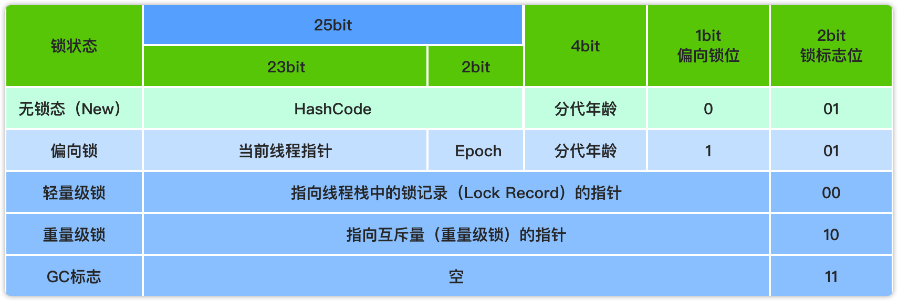

# Java多线程基础知识

## 多线程基础

### 为什么会有多线程

单核发展到瓶颈，通过多核心解决。多核心意味着操作系统有更多的并行计算资源可以使用。操作系统是以线程作为基本的调度单元。

> NUMA架构，UMA架构

### 线程调度

各个应用创建出来的线程，不能直接在CPU上运行，都必须经过操作系统调度，操作系统负责线程的执行。现在常用的调度器CFS（完全公平调度器）。

### Java线程的创建过程

在Java中线程有三个层面的含义：Java层、JVM层、OS层。


> 调用Thread#start()才会创建线程。

### 用户级线程和内核级线程

线程的实现可以分为两大类：用户级线程和内核级线程

在用户级线程中，线程的创建管理操作都由应用程序自己负责，内核意识不到多线程的存在。相当于应用程序模拟了CPU调度器的功能，线程只在应用程序的进程内进行资源竞争。

内核级线程中，线程的管理工作都由内核完成，应用程序不进行线程管理，只有一个到内核级线程的编程接口。线程在全系统内进行资源的竞争。

**多线程的模型**

* 一对一模型

  一个用户级线程对应一个内核级线程。Java使用的是该线程模型，这也是为什么说Java是裸线程。
  优点：并发能力强，一个用户级线程被阻塞，其他用户线程还能执行。
  缺点：创建线程的开销大，每一个用户级先都需要有一个内核级线程与之对应，性能相对低。

* 多对一模型

  将多个用户级线程对应一个内核级线程，线程管理在用户空间完成。
  优点：线程管理在用户空间进行，因此效率比较高。
  缺点：一个线程在使用内核级线程阻塞时，整个进程都会被阻塞。

* 多对多模型
  
  将n个用户级线程映射到m个内核级线程上，要求m<=n；是前面两种模式的折中。Go使用该模式。

[Linux用户级线程和内核级线程区别](https://www.cnblogs.com/Mered1th/p/10745137.html)

### 进程、线程、协程、纤程

**进程和线程的区别：**

进程是资源分配的最小单位，线程是cpu系统调度的最小单位。线程之间的内存可以共享，进程之间不可以；一个进程上可以运行多个线程。进程可以fock出子进程。

**纤（xian）程**

因为Java的线程模型是一对一的形式，不支持多对多的模式，所以有第三方类库提供了类似go语言线程的模式，提出纤程的概念。纤程是线程中的线程，切换和调度不经过操作系统内核，占用的资源更小。
提供的第三方jar [Quasar](http://docs.paralleluniverse.co/quasar/)、[kilim](https://github.com/kilim/kilim)提供了实现。

**协程**

协程，go语言的概念，和纤程类似。

## Java多线程

### 创建线程的方式

* 实现Runnable接口
* 实现Callable接口
* 继承Thread类

**实现Runnable和Callable接口的类不是真正意义上的线程，还需要通过Thread来调用。**

**实现接口 VS 继承Thread**

Java不支持多继承（菱形问题），继承了Thread类之后不能再继承其他的类，但是通过实现接口的方式创建线程可以；继承整个Thread开销太大。

### 线程的状态


* New（新建）：创建后尚未运行。
* Runnable（可运行）：可能正在运行，也可能正在等待CPU时间片。Runnable状态包括操作系统中的Running和Ready。
* Blocked（阻塞）：等待一个排它锁，如果线程释放了锁，这个状态就会解除。
* Waiting（无限期等待）：等待其他线程显示唤醒，否则不会运行。
  * 进入方法：没有设置Timeout参数的Object.wait()方法；没有设置Timeout参数的Thread.join()方法；LockSupport.part()方法。
  * 退出方法：Object.notify()/Object.notifyAll()；被调用的线程执行完毕；LockSupport.unpark(Thread)。
* Time Waiting（限期等待）：无需其他线程显示唤醒，在一定时间后自动被系统唤醒。
  * 进入方法：Thread.sleep() 方法；设置了Timeout的Object.wait()方法；设置了Timeout的Thread.join()方法；LockSupport.parkNanos() 方法；LockSupport.parkUntil() 方法。
  * 退出方法：时间结束；时间结束/Object.notify()/Object.notifyAll()；时间结束/被调用的线程执行完毕；时间结束/ LockSupport.unpark(Thread)；时间结束/LockSupport.unpark(Thread)。
* Terminated（终止）：线程执行结束或者执行产生异常。

**Runnable状态包括操作系统线程状态中的Running和Ready。**

> Thread.sleep(long millis, int nanos); nanos基本没什么作用，nanos > 500000,millis+1。
> 时间都是不准确的，即使有时间同步服务器，每个服务器去获取时间也是有不同的延迟的。
> Window上早期的API获取到的文件的修改时间是到分的。

### Thread类

#### Thread类主要方法和属性

|重要属性/方法|说明|
|--|--|
|volatile String name;|线程名称-诊断分析使用|
|boolean daemon = false;|后台守护线程标志 – 决定JVM优雅关闭|
|Runnable target;|任务(只能通过构造函数传入)|
|synchronized void start()|启动新线程并执行，只能执行一次，否则会抛出IllegalThreadStateException|
|void join()|等待某个线程执行完毕（来汇合）|
|static native Thread currentThread();| 静态方法: 获取当前线程信息|
|static native void sleep(long millis);|静态方法: 线程睡眠并让出CPU时间片，但是不会释放锁|
|boolean isInterrupted()|返回调用线程的中断状态，不会重置中断状态。|
|static boolean interrupted()|返回当前线程的中断状态并将中断状态重置为false。|
|static native void yield()|线程让步，当前线程会从运行状态进入就绪状态，它会把CPU执行的时间让掉，让其他或者自己线程执行。|

#### Object类主要方法和属性

|Object#方法|说明|
|--|--|
|void wait()|放弃锁+等待0ms+尝试获取锁|
|void wait(long timeout, int nanos)|放弃锁 + 等待指定时间自动唤醒/中途唤醒（唤醒只会需要自动获取锁）|
|native void wait(long timeout) |放弃锁 + 等待到指定时间自动唤醒/中途被唤醒（唤醒只会需要自动获取锁）|
|native void notify()|发送信号通知1个等待线程|
|native void notifyAll()|发送信号通知所有等待线程|

#### Thread的状态改变操作

* Thread.sleep(long millis)，当前线程调用此方法，进入TIMED_WAITING状态，但不会释放对象锁，millis后线程自动苏醒进入就绪状态。作用：给其它线程执行机会的最佳方式。
* Thread.yield()，线程让步，当前线程会从运行状态进入就绪状态，它会把CPU执行的时间让掉，让其他或者自己线程执行。
* t.join()/t.join(long millis): 在当前线程里调用t线程的join方法，当前线程会进入WAITING/TIMED_WAITING状态，当前线程不会释放已经持有的对象锁，但是会释放t线程的锁。**会释放t的锁，是t对象上的锁，不是t拥有的锁**
* obj.wait()，当前线程释放对象锁，进入等待队列。
* obj.notify()，唤醒在此对象监视器上等待的单个线程，选择是任意性的。notifyAll() 唤醒在此对象监视器上等待的所有线程。

#### Thread的中断与异常处理

* 线程内部自己处理异常，不溢出到外层。
* 调用interrupt()被中断的线程，会抛出一个InterruptedException中断异常（该线程必须事先预备好处理此异常）
* 如果是计算密集型的操作：分段处理，每个片段检查一下状态，是不是要终止。

> Thread.currentThred().getThreadGroup().activeCount() = Thread.activeCount(), 获取当前线程组的活跃线程。
> 线程组，线程组内创建的线程都依附于主线程，修改了也会被覆盖。
> 默认启动的main方法的线程组是main，有两个线程，一个线程name是main，一个是Monitor，Monitor是用来实现在命令行Ctrl+c停止main方法的。
> 怎么让java的mian方法不退出，System.out.read()
> Thread.sleep：释放CPU资源。
> Object#wait：释放CPU资源和锁。

## 线程安全

### 多线程遇到的问题

多个线程竞争同一资源时，如果对资源的访问顺序敏感，就称存在竞态条件。

导致竞态条件发生的代码区称作临界区。

不进行恰当的控制，会导致线程安全问题同步/加锁。

### 并发相关的性质  

原子性：原子操作，注意和事物的ACID里的原子性区别与联系。

可见性：对于可见性，Java提供了volatile关键字来保证可见性。在jvm中，方法执行时保存的变量，是主内存中的副本，每次读写都是操作该副本，通过加上volatile，可以强制在每次读的时候从主内存中获取，写的时候立即更新回主内存。

通过synchronized和Lock也可以保证可见性，同时也能保证原子性，**volatile只能保证原子性。**

有序性：Java允许编译器和处理器对指令进行重排序，这不会影响单线程程序的执行，但是会影响到多线程并发执行的正确性。可以通过volatile关键字保证一定的”有序性“（synchronized和lock也可以）。

Java规定了先行发生原则，通过这个原则，让一个操作无需控制，就可以先行于另一个操作的发生。

happend-before原则（先行发生原则）：

* 单一线程原则(Single Thread rule)：在一个线程内，在程序前面的操作先行发生于后面的操作。
* 管程锁定规则(Monitor Lock Rule)：一个 unlock 操作先行发生于后面对同一个锁的 lock 操作。
* volatile变量规则(Volatile Variable Rule)：对一个 volatile 变量的写操作先行发生于后面对这个变量的读操作。
* 线程启动规则(Thread Start Rule)：Thread 对象的 start() 方法调用先行发生于此线程的每一个动作。
* 线程加入规则(Thread Join Rule)：Thread 对象的结束先行发生于 join() 方法返回。
* 线程中断规则(Thread Interruption Rule)：对线程 interrupt() 方法的调用先行发生于被中断线程的代码检测到中断事件的发生，可以通过 interrupted() 方法检测到是否有中断发生。
* 对象终结规则()：一个对象的初始化完成（构造函数执行结束）先行发生于它的 finalize(Finalizer Rule)： 方法的开始。
* 传递性(Transitivity)：如果操作 A 先行发生于操作 B，操作 B 先行发生于操作 C，那么操作 A 先行发生于操作 C。

### 可重入性

* 锁的可重入性

  当一个线程再次请求它持有的对象锁的资源时，这种情况称为重入，如果可以获得锁，就称为可重入性。

* 可重入代码

  这种代码也叫做纯代码（Pure Code），可以在代码执行的任何阶段中断它，去执行其他代码，而后继续执行该代码，不会出现任何错误。
  可重入代码有一些共同的特征，例如不依赖存储在堆上的数据和公用的系统资源、用到的状态量都由参数中传入、不调用非可重入的方法等。

### synchronized

#### 定义

同步关键字，JVM提供的锁机制，不需要手动释放锁资源，支持可重入。

#### 使用方式

* 同步一个代码块，只能实现同一对象对代码块的访问互斥。

```java
public void test(){
    //...
    synchronized(this){
        //...
    }
    //..
}
```

* 同步一个方法，只能实现同一个对象访问该方法的互斥。**和该类的其他同步方法也互斥。**

```java
public synchronized void test(){
    //...
}
```

* 同步一个类，作用于整个类，每个对象访问该类的该方法都会互斥。**和该类的其他类同步代码块也互斥。**

```java
public void test(){
    //...
    synchronized(SynchronizedExample.class)){
        //...
    }
    //...
}
```

* 同步一个静态方法，每个对象访问该类的该方法都会互斥。**和该类的其他类同步代码块也互斥。**

```java
public synchronized void test(){
    //...
}
```

#### 实现原理

JDK1.6之前，synchronized的实现是使用monitor，这种同步方式的成本非常高，包括系统调用引起的内核态与用户态切换、线程阻塞造成的线程切换等，因此这种锁为“重量级锁”。

#### synchronized实现过程

* 1.java代码层面使用synchronized关键字实现；
* 2.java字节码层面使用monitorenter、monitorexit指令实现；
* 3.虚拟机执行过程中，通过锁优化升级实现；
* 4.CPU汇编指令层面通过lock comxchg实现。

#### monitor（管程）

monitor（管程，又可以叫做监视器）可以理解为一个同步工具，通常被描述为一个对象。任意一个对象都有一个自己的监视器，使用Synchronized进行同步，关键是对当前对象的monitor进行获取，当线程获取monitor后才能继续往下执行，否则就只能等待。而这个获取的过程是互斥的，即同一时刻只有一个线程能够获取到monitor。Synchronized先天具有重入性。每个对象拥有一个计数器，当线程获取该对象锁后，计数器就会加一，释放锁后就会将计数器减一。

在Hotspot中，monitor由ObjectMonitor实现，关键字段：

* _count: 记录owner线程获取锁的次数；
* _owner: 指向持有ObjectMonitor对象的线程；
* _WaitSet: 存放处于wait状态的线程队列，调用了Object#wait()方法；
* _EntryList: 存放处于等待锁block状态的线程队列；
* _recursions: 锁的重入次数。

#### synchronized锁优化

jdk6对synchronized锁进行了大量优化，包括轻量级锁、偏向锁、锁粗化、锁消除等。

对象头的Mark Word里存储着对象的HashCode，分代年龄和锁标志位信息。

64位虚拟机下的Mark Word（64bit）：


32位虚拟机下的Mark Word（64bit）：



##### 锁消除

锁消除是指虚拟机在JIT编译期间，对要求同步的代码进行分析，如果检测到不可能存在共享资源的竞争，就将共享资源上的锁进行消除。锁消除需要依赖逃逸分析的数据支持，如果一段代码中的数据不会逃逸出去被其他线程访问到，那么就可以把它们当做栈上的数据对待，不需要进行锁同步。通过锁消除可以节省无意义的锁请求时间。

##### 锁粗化

如果虚拟机检测到一系列零碎的操作都对一个对象加锁，就会把加锁范围扩展到整个操作序列的外部。

##### 无锁

无锁是指没有对资源进行锁定，一般偏向锁和自旋锁都是无锁，但是在实际使用上，刚刚创建对象就是无锁状态。

##### 偏向锁

jdk6引入的优化，偏向第一个访问锁的线程。当一个同步代码被线程第一次访问时，会将当前线程id写入的到对象头的Mark Word，该线程下次访问同步代码块的时候，检查Mark Word里是否存储着指向当前线程的偏向锁，如果存在就直接获取锁，不需要进行CAS操作，否则锁就要升级。

偏向锁的优化：多数同步代码块都是被同一个线程多次访问，不需要直接进行锁竞争。同一个线程多次获取同一个锁的时候，不需要每次都进行获取锁和释放锁的CAS操作。

偏向锁在JDK6及之后版本的 JVM 里是默认启用的。可以通过JVM参数关闭偏向锁：`-XX:-UseBiasedLocking`，关闭之后程序默认会进入轻量级锁状态。

参数`-XX:BiasedLockingStartupDelay=4000`表示延迟多久启动偏向锁模式，默认4s。JDK10将默认值改为0，原因性能运行显示4000 ms延迟与无延迟之间没有差异，延迟会导致VM额外的工作。

##### 轻量级锁

当锁是偏向锁的时候，被其他线程访问时，此时的偏向锁就需要升级成轻量级锁。轻量级锁的本质是自旋锁，通过线程自旋的形式尝试获取锁，线程不会阻塞，从而提高性能。

轻量级锁的工作过程：

* 线程在获取锁时，如果当前对象没有被锁定，JVM会在当前线程的栈帧中建立一个锁记录（Lock Record）空间，用来存储锁对象的Mark Word的拷贝。
* JVM使用CAS的方式尝试将锁对象的Mark Word更新为指向Lock Record的指针，如果操作成功，表明当前线程获取锁成功。
* 如果获取失败，说明存在其他线程在竞争锁，JVM会检查对象的Mark Word指针是否指向当前线程的锁记录空间，如果是直接获取锁，否则就说明这个锁被其他线程占用了，就需要等待。

自旋锁的限制：

自旋锁虽然避免了线程切换的开销，但是要占用处理器的时间，适合锁占用时间很短的情况，如果锁占用时间很长或者竞争锁的线程很多，那么自旋会占用的时间很长，消耗资源。~~所以，自旋等待需要有一定的限制，JVM默认自旋次数是10次（也可以使用参数`-XX:PreBlockSpin`指定），如果超过这个次数就会挂起当前线程。~~ JDK6引入了自适应自旋，自适应自旋会根据前一次在同一个锁上的自旋时间以及锁的拥有者的状态来决定接下来的自旋时间。

##### 重量级锁

重量级锁是指当一个线程获取到锁的之后，其他等待获取该锁的线程都会进入blocked状态。它的实现是通过对象的monitor（监视器）实现，而其中 monitor 的本质是依赖于底层操作系统的 Mutex Lock 实现，操作系统实现线程之间的切换需要从用户态切换到内核态，切换成本非常高。

#### 锁升级的过程

锁升级的过程，以创建对象开始为例：


* T object = new T();

  刚创建的对象根据当前偏向锁的配置情况不同：
  * 如果偏向锁开启（jdk6之后默认开启）并且达到偏向锁规定的延迟时间（-XX:BiasedLockingStartupDelay=4000，默认4s），锁状态为偏向锁(`101`)。
     示例：

    ```text
      OFFSET  SIZE   TYPE DESCRIPTION                               VALUE
      0     4        (object header)                           05 00 00 00 (00000101 00000000 00000000 00000000) (5)
      4     4        (object header)                           00 00 00 00 (00000000 00000000 00000000 00000000) (0)
    ```

  * 否则，锁状态为无锁状态(`001`)。

    示例：

    ```text
      OFFSET  SIZE   TYPE DESCRIPTION                               VALUE
      0     4        (object header)                           01 00 00 00 (00000001 00000000 00000000 00000000) (1)
      4     4        (object header)                           00 00 00 00 (00000000 00000000 00000000 00000000) (0)
    ```

* object.hasCode();

  当调用对象的hashCode方法时，根据当前对象是否重写Object#hashCode()方法和锁状态的情况区别对待：

  * 如果当前对象没有重写Object#hashCode()并且为无锁状态，修改锁为无锁状态(`001`)，将hashCode的值保存到Mark Word中。

    示例：

    ```text
    OFFSET  SIZE   TYPE DESCRIPTION                               VALUE
      0     4        (object header)                           01 c6 a0 6e (00000001 11000110 10100000 01101110) (1856030209)
      4     4        (object header)                           0e 00 00 00 (00001110 00000000 00000000 00000000) (14)
    ```
  
  * 如果当前对象没有重写Object#hashCode()并且为偏向锁状态，取消偏向锁状态，修改锁状态为无锁状态(`001`)，将hashCode的值保存到Mark Word中。

    示例：

    ```text
    OFFSET  SIZE   TYPE DESCRIPTION                               VALUE
      0     4        (object header)                           01 12 f6 82 (00000001 00010010 11110110 10000010) (-2097802751)
      4     4        (object header)                           73 00 00 00 (01110011 00000000 00000000 00000000) (115)
    ```

  * 如果当前对象重写了Object#hashCode()，则锁状态不会改变，Mark Word也不会改变。

    示例：

    ```text
    OFFSET  SIZE   TYPE DESCRIPTION                               VALUE
      0     4        (object header)                           05 00 00 00 (00000101 00000000 00000000 00000000) (5)
      4     4        (object header)                           00 00 00 00 (00000000 00000000 00000000 00000000) (0)
    ```

* 第一次调用同步代码块synchronized(object)

  * 如果对象是无锁状态，更新锁状态为轻量级锁(`00`)，Mark Word中记录下锁记录（Lock Record）的空间指针，这个时候如果Mark Word中记录了hashCode会被记录到锁记录中。

    ```text
     OFFSET  SIZE   TYPE DESCRIPTION                               VALUE
      0     4        (object header)                           c0 29 6f 09 (11000000 00101001 01101111 00001001) (158280128)
      4     4        (object header)                           00 70 00 00 (00000000 01110000 00000000 00000000) (28672)
    ```

  * 如果对象是偏向锁状态，那么锁状态还是偏向锁，Mark Word中记录下获取锁的线程指针。

    ```text
     OFFSET  SIZE   TYPE DESCRIPTION                               VALUE
      0     4        (object header)                           05 d8 80 fe (00000101 11011000 10000000 11111110) (-25110523)
      4     4        (object header)                           bb 7f 00 00 (10111011 01111111 00000000 00000000) (32699)
    ```

* 其他线程调用同步代码块synchronized(object)
  当其他线程调用同步代码块时，偏向锁模式立马结束，进入轻量级锁模式(锁状态为`00`)，如果锁竞争激烈
  升级为重量级锁。

#### 锁降级的过程

重量级锁的降级发生于STW阶段，降级对象就是那些仅仅能被VMThread访问而没有其他JavaThread访问的对象。

[参考: Hotspot JVM锁是否可以降级？](https://www.zhihu.com/question/63859501)

### volatile

volatile关键字的作用是保证线程可见性和禁止指令重排序。

线程可见性：对变量做的改动会立即被其他线程可见。

#### 内存屏障

**JMM的内存屏障**

JMM通过内存屏障禁止指令重排序，内存屏障在JMM是一个规范。

JMM规定了四种内存屏障分别是：

* LoadLoad屏障：对于这样的语句Load1; LoadLoad; Load2，在Load2及后续读取操作要读取的数据被访问前，保证Load1要读取的数据被读取完毕。
* StoreStore屏障：对于这样的语句Store1; StoreStore; Store2，在Store2及后续写入操作执行前，保证Store1的写入操作对其它处理器可见。
* LoadStore屏障：对于这样的语句Load1; LoadStore; Store2，在Store2及后续写入操作被刷出前，保证Load1要读取的数据被读取完毕。
* StoreLoad屏障：StoreLoad屏障：对于这样的语句Store1; StoreLoad; Load2，在Load2及后续所有读取操作执行前，保证Store1的写入对所有处理器可见。**它同时具有其他几类屏障的效果，可以用来代替另外三种内存屏障。**

内存屏障另一个作用是强制更新一次不同CPU的缓存。

**内存屏障和volatile的关系**：

volatile通过内存屏障实现禁止指令重排序。

JMM保守策略下内存屏障的插入策略：

* 在每个volatile写操作前插入StoreStore屏障，在写操作后插入StoreLoad屏障；
* 在每个volatile读操作后插入LoadLoad屏障，在读操作后插入LoadStore屏障；

#### Hotspot对volatile实现

**Hotspot底层使用lock指令实现volatile的线程可见性和禁止指令重排序。lock指令相当于实现了内存屏障的机制。**

**lock指令**

lock用于在处理器中执行指令时对共享内存的独占使用。它的作用就是能够将当前处理器对应缓存的内容刷新到内存，并且使得其他处理器对应的缓存失效。另外还提供了有序的指令无法越过这个内存屏障的作用。

> lock是对所有cpu平台支持，不同的cpu本身提供了内存屏障的指令，但是Hotspot没有使用。
> lock addl$0x0，(%esp)指令把修改同步到内存时，意味着所有之 前的操作都已经执行完成，这样便形成了“指令重排序无法越过内存屏障”的效果。

#### volatile为什么只能保证可见性不能保证原子性？

对于一个赋值操作，在编译成字节码指令会是多条，而每条字节码指令又可能翻译成若干条本地机器码指令，因此即使保证了可见性，一个赋值操作也并不是原子性的。所以无法保证原子性。

> 双锁检测（Double Check Lock，DCL）单例代码，为什么要加volatile。

#### volatile使用注意

* 每次读取都强制从主内存刷数据。
* 适用场景：单个线程写；多个线程读。
* 原则： 能不用就不用，不确定的时候也不用。
* 替代方案： Atomic 原子操作类。
* 避免指令重排序。

### CAS

简介：

CAS操作又称为无锁技术，是一种乐观锁策略，它假设访问共享资源时不会出现冲突，所以不需要加锁，而是使用compare and swap（比较交换）解决冲突。

实现过程：

CAS的过程可以简单的理解为CAS(V,O,N)，三个值分别为：V表示当前变量的内存地址，O表示当前变量的旧值（预期值），N表示要修改成的新值。如果内存中的原值与O相同，就直接更新为N；如果与O不同，更新失败。

CAS的原子性如何实现：

CAS要想保证线程安全，在compose and swap过程中必须要是原子性的，需要CPU原语支持。底层使用`lock cmpxchg`指令(如果是单核使用`cmpxchg`指令)，实现，这个指令时一个汇编指令，它保证操作在CPU执行时是原子性的。

CAS的问题:

* ABA问题
  对于ABA问题的解决方式可以添加一个version，每次更新数据时version都单调递增，在CAS中和原值比较时，不仅比较和原值是否相同，还比较version是否相同。jdk1.5提供的AtomicStampedReference类就使用该方式。大部分情况下 ABA 问题不会影响程序并发的正确性。

* 自循环时间消耗
  使用自旋CAS的方式实现共享资源互斥，如果长时间不成功，会给CPU带来非常大的执行开销。
  解决方式：1.代码层面，可以在循环中判断，当超过一定时间或次数时退出。2.当多个线程竞争时，将粒度变小，将一个变量拆分为多个变量，达到多个线程访问多个资源的效果，最后再调用sum把它合起来，能降低CPU消耗。

* CAS只能实现单变量操作
  CAS无法支持多个共享变量的原子操作。这个时候可以通过加互斥锁实现原子性，或者将多个共享变量合成一个共享变量。

CAS应用：

* jdk提供的ReentrantLock，底层使用就是CAS实现加锁释放锁。
* synchronized的轻量级锁使用的也是CAS实现。

> lock：几乎所有CPU都支持的指令，用来锁总线。在这里加lock的目的是，在执行后面的指令时不被其他指令打断。所以单核不需要添加lock。

### final

Java里的常量替换，对于final定义的变量，在使用时会替换成常量。推荐能用final的地方尽量用final。

> 传值的参数都尽量使用final。

## 线程池原理与应用

### 线程池相关类

* Executor：执行者-顶层接口
* ExecutorService：接口API
* ThreadFactory：线程工厂
* Executors：工具类

#### Executor - 执行者

从功能上看就是一个线程的执行器。只有一个方法execute()用于执行线程。

#### ExecutorService

拓展了Executor类，主要方法：

|方法|说明|
|--|--|
|void execute(Runable  command)|执行可运行的任务|
|Future<?> submit(Runnable task)|提交任务，允许获取执行结果|
|\<T> Future\<T> submit(Runnable task, T result)|提交任务，指定结果；控制\|获取执行结果|
|\<T> Future\<T> submit(Callable<T> task); |提交任务; 允许控制任务和获取执行结果|
|void shutdown()|停止接收新任务，原来的任务继续执行|
|void shutdownNow()|停止接收新任务，原来的任务停止执行|
|boolean awaitTermination(long timeOut, TimeUnit unit)|当前线程阻塞，等待线程池的终止|
|boolean isShutdown()|返回当前线程是否关闭|
|boolean isTerminated()|如果在关闭线程池后，所有任务都结束返回true|

>submit 方法发生异常可以在主线程中 catch 到。
>execute 方法执行任务是捕捉不到异常的。

#### ThreadFactory

线程工厂，用来创建线程。主要方法：Thread newThread(Runnable r);创建新线程。

#### ThreadPoolExecutor

线程池的实现。

**线程池参数**

* corePoolSize：核心线程数
* maximumPoolSize：允许最大线程数
* keepAliveTime：当线程数大于核心线程数时，空闲线程等待超过这时间会被回收
* workQueue：缓冲队列
* threadFactory：创建线程的工厂类
* RejectedExecutionHandler：拒绝策略

**缓冲队列**

BlockingQueue是双缓冲队列。BlockingQueue内部使用两条队列，允许两个线程同时向队列一个存储，一个取出操作。在保证并发安全的同时，提高了队列的存取效率。

* 1.ArrayBlockingQueue:规定大小的 BlockingQueue，其构造必须指定大小。其所含的对象是 FIFO 顺序排序的。
* 2.LinkedBlockingQueue:大小不固定的 BlockingQueue，若其构造时指定大小，生成的 BlockingQueue 有大小限制，不指定大小，其大小有 Integer.MAX_VALUE 来决定。其所含的对象是 FIFO 顺序排序的。
* 3.PriorityBlockingQueue: 无边界阻塞队列，类似于 PriorityQueue，但是其所含对象的排序不是 FIFO，而是依据对象的自然顺序或者构造函数的 Comparator 决定。**无边界可能会导致OutOfMemoryError。**
* 4.SynchronousQueue: 特殊的 BlockingQueue，对其的操作必须是放和取交替完成。

**拒绝策略**

* 1.ThreadPoolExecutor.AbortPolicy:丢弃任务并抛出 RejectedExecutionException异常。
* 2.ThreadPoolExecutor.DiscardPolicy：丢弃任务，但是不抛出异常。
* 3.ThreadPoolExecutor.DiscardOldestPolicy：丢弃队列最前面的任务，然后重新提交被拒绝的任务。
* 4.ThreadPoolExecutor.CallerRunsPolicy：由调用线程（提交任务的线程）处理该任务。

**ThreadPoolExecutor提交任务逻辑：**

* 1.判断corePoolSize是否达到，未达到创建核心线程；
* 2.corePoolSize满了，将线程加入workQueue；
* 3.workQueue满了，判断maximumPoolSize创建线程;
* 4.maximumPoolSize超过，执行拒绝策略处理器。

**这种提交任务逻辑的好处：**

* 机器的CPU核心数有限，如果一开始创建达到maximumPoolSize数量的线程，势必会影响性能。
* 很多线程执行的任务可能很快就会结束，将新加入的任务先放入队列中，可以重用其他任务释放的线程资源，避免重复创建。

#### Executors

创建线程池的工具类，底层都是new ThreadPoolExecutor实现。

#### Callable

Runnable#run()没有返回值；Callable#call()方法有返回值。

#### Future

实现了异步获取执行结果。

**主要方法**

|方法|说明|
|--|--|
|boolean cancel(boolean mayInterruptIfRunning);|取消任务（执行时是否打断）|
|boolean isCancelled();|是否被取消|
|boolean isDone();|是否执行完毕|
|V get() throws InterruptedException, ExecutionException;|获取执行结果|
|V get(long timeout, TimeUnit unit)throws InterruptedException, ExecutionException, TimeoutException;|限时获取执行结果|

#### CompletableFuture

jdk8新增的类，拓展了Future没有的通知模式。对于异步执行的结果，可以将回调在与任务不同的线程中执行，也可以将回调作为继续执行的同步函数，在与任务相同的线程中执行。

### 常见线程池

* CachedThreadPool
  
  一个可缓存的线程池，**缓冲队列使用的是SynchronousQueue。**
  创建方式：ExecutorService pool = Executors.newCachedThreadPool();
  特点：
  * 会重用之前的线程。
  * 适合执行许多短期的异步任务
  * 如果没有可用的线程，则创建一个，最大线程数是Integer.MAX_VALUE
  * 默认为60s未使用就被终止和移除
  * 长期闲置的池将会不消耗任何资源

* FixedThreadPool

  固定大小的线程池，核心线程数和最大线程数一致。如果某个线程因为执行异常而结束，那么线程池会补充一个新线程。**缓冲队列使用LinkedBlockingQueue，可以缓存无穷多的任务，如果任务处理不过来会积压，产生OOM。**
  创建方式：ExecutorService pool = Executors.newFixedThreadPool(10);

* SingleThreadExecutor

  创建一个单线程的线程池，单线程执行所有的任务。如果这个线程因为异常结束，会有一个新的线程替代它。**缓冲队列使用的是LinkedBlockingQueue，可以缓存无穷多的任务，如果任务处理不过来会积压，产生OOM。**
  创建方式：ExecutorService pool = Executors.newSingleThreadExecutor();

* ScheduledThreadPool

  支持定时和周期性任务的执行的线程池，阻塞队列使用DelayedWorkQueue。在提交任务的时候可以指定延迟执行的时间。
  创建方式：ExecutorService pool = Executors.newScheduledThreadPool(10);

* ForkJoinPool

  JDK7提供的原生多线程并行处理框架，采用分治思想，将大任务拆分成多个小任务并行执行，然后汇总任务结果。使用工作窃取（work-stealing）算法。
  创建方式：ForkJoinPool forkJoinPool = new ForkJoinPool();
  * 实现原理：
    每个工作线程都维护着一个双端的工作队列(WorkQueue)，存放任务(ForkJoinTask)；
    fork的子任务只会被丢进所在线程的工作队列；
    工作线程通过LIFO的方式获取本地任务；
    当工作线程没有任务时，会采用FIFO的顺序随机窃取一个工作线程的任务。
  
  工作线程获取本地任务和窃取其他线程任务的方式不同，这样可以减少竞争。获取本地线程使用LIFO的顺序，可以保证获取到的任务都是尾部的小任务，窃取任务使用FIFO的顺序，可以保证窃取到的任务都是大任务，这样窃取的性价比更高。

* WorkStealingPool
  jdk1.8添加，底层使用ForkJoinPool实现（jdk1.7）， 适合大规模长时间的的任务执行。
  创建方式：ForkJoinPool executorService = (ForkJoinPool) Executors.newWorkStealingPool();

### 线程池应用场景

CachedThreadPool适合于服务器负载小，执行许多短期的异步任务。
FixedThreadPool适用于执行可预测的线程数量的业务中，或者服务器负载大，需要限制线程的执行。
SingleThreadExecutor可以保证线程的顺序执行，不会有多个线程是活动的场景。
ScheduledThreadPool适用于需要多个后台线程执行周期任务的场景。
WorkStealingPool适用于将大任务拆分成小任务执行。

### 创建固定线程池的经验

开发中经常使用的是固定线程池大小的线程池。

* 如果是CPU密集型应用，则线程池大小设置为N或者N+1。
* 如果是IO密集型应用。则线程池大小设置为2N或2N+2。

>开源项目: PMC ==》 10人左右 Commtter ==》 20-30人左右 Contributor ==》 100-200人
>大的银行核心都是db2。
>分布式数据库，云数据库解决的不是性能问题，是容量问题。
>DSL：领域特定语言。举例：某个行业或者领域有特定的语言（特定的黑话），这个特定语言，不需要作解释大家都懂。

## 中断协议

### 线程的中断

每个线程都有一个boolean属性，表示线程的中断状态（interrupted status）

中断线程是通过调用线程的interrupt()方法实现，调用该方法可能出现的情况：

* 如果线程当前执行的是一个低级可中断的方法，例如：Thread.sleep()、Thread.join()、Object#wait()，那么它将取消阻塞并抛出InterruptedExecution。但是不能中断I/O阻塞和synchronized锁阻塞。
* 否则，interrupt()只是将线程设置为中断状态。

方法interrupted()：获取线程是否已经中断。在线程中可以通过循环判断是否发出中断信号，决定当前线程是否停止。

### Executor的中断操作

方法shutdownNow()：表示中断线程池，根据实现不同处理可能不同，常见的实现是调用每个线程的interrupt()方法。
只想中断其中一个任务，可以通过submit提交任务后获取到的Future，调用Future#cancel(true)实现。

## Tips

* git clone url -depth=1，只克隆最新的一个commit。
* git log --oneline -10 只显示最新的10条提交记录的第一行。
* spirng增强，只有通过spring获取的对象调用方法时，才能使用到方法上的增强。
* DCL单例，Double Check Lock
* 
## 参考

* [synchronized四种锁状态的升级](https://www.jianshu.com/p/d61f294ac1a6)
* [synchronized锁解析](http://www.360doc.com/content/20/0602/17/70282097_916085028.shtml)
