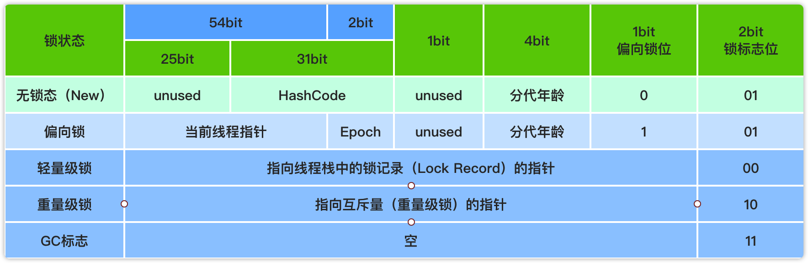
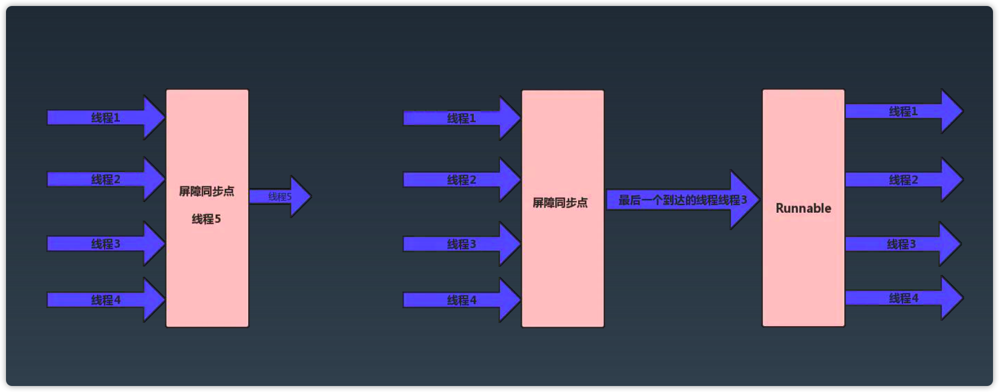

# Java并发编程和安全

## Java并发包

### JDK核心库的包

java.lang.* 最基础的核心的，Integer/String和基础类。
java.io.*  io读写，文件操作。
java.util.* 工具类，集合、日期。
java.match.* 数学计算，BigInteger。
java.net.* 网络编程，Socket。
java.rmi.* Java内置的远程调用。
java.sql.* JDBC操作数据库。

以上是JDK公开API，所有JDK都需要实现的。

javax.* java扩展API
sun.*  sun的JDK实现包

> awt使用的是操作系统的ui，做出来的ui和操作系统的ui很像。
> swing使用的自己画的ui，和操作系统原生的不一样。

### Java并发包

java.util.conurrency

java并发包包含的内容：锁、原子类、线程池、工具类、集合类。

* 锁机制类 Locks : Lock, Condition, ReadWriteLock
* 原子操作类 Atomic : AtomicInteger
* 线程池相关类 Executer : Future, Callable, Executor
* 信号量三组工具类 Tools : CountDownLatch, CyclicBarrier, Semaphore
* 并发集合类 Collections : CopyOnWriteArrayList, ConcurrentMap

## synchronized锁

JVM提供的锁机制，不需要手动释放资源，可重入、分公平锁。支持同步一个代码块、同步一个实例方法、同步一个类、同步一个静态方法。

### 锁优化

jdk6对synchronized锁进行了大量优化，包括偏向锁、轻量级锁、锁消除、锁粗化。

### 对象头的Mark Word

对象头的Mark Word里存储着对象的HashCode，分代年龄和锁标志位信息。

64位虚拟机MarkWord：



### 偏向锁

偏向第一个访问锁的线程，当一个同步代码被线程第一次访问时，会将当前线程id写入的到对象头的Mark Word，该线程下次访问同步代码块的时候，检查Mark Word里是否存储着指向当前线程的偏向锁，如果存在就直接获取锁，不需要进行CAS操作，否则锁就要升级。

**相关参数：**

* -XX:+UseBiasedLocking：表示启用偏向锁，JDK6默认启用。
* -XX:BiasedLockingStartupDelay=4000：表示JVM启动后延迟多少ms使用偏向锁，默认4s，JDK10开始默认0s。

### 轻量级锁

轻量级锁的本质是自旋锁，通过线程自旋的形式尝试获取锁，线程不会阻塞，从而提高性能。

**工作过程**

* 1.线程在获取锁时，如果当前对象没有被锁定，JVM会在当前线程的栈帧中建立一个锁记录（Lock Record）空间，用来存储锁对象的Mark Word的拷贝。
* 2.JVM使用CAS的方式尝试将锁对象的Mark Word更新为指向Lock Record的指针，如果操作成功，表明当前线程获取锁成功。
* 3.如果获取失败，说明存在其他线程在竞争锁，JVM会检查对象的Mark Word指针是否指向当前线程的锁记录空间，如果是直接获取锁，否则就说明这个锁被其他线程占用了，就需要等待。

**自旋锁的限制**

自旋锁虽然避免了线程切换的开销，但是要占用处理器的时间，适合锁占用时间很短的情况，如果锁占用时间很长或者竞争锁的线程很多，那么自旋会占用的时间很长，消耗资源。JDK6引入了自适应自旋，自适应自旋会根据前一次在同一个锁上的自旋时间以及锁的拥有者的状态来决定接下来的自旋时间。

### 重量级锁

重量级锁是指当一个线程获取到锁的之后，其他等待获取该锁的线程都会进入blocked状态。它的实现是通过对象的monitor（监视器）实现，而其中 monitor 的本质是依赖于底层操作系统的 Mutex Lock 实现，操作系统实现线程之间的切换需要从用户态切换到内核态，切换成本非常高。

### 锁消除

锁消除是指虚拟机在JIT编译期间，对要求同步的代码进行分析，如果检测到不可能存在共享资源的竞争，就将共享资源上的锁进行消除。锁消除需要依赖逃逸分析的数据支持，如果一段代码中的数据不会逃逸出去被其他线程访问到，那么就可以把它们当做栈上的数据对待，不需要进行锁同步。通过锁消除可以节省无意义的锁请求时间。

### 锁粗化

如果虚拟机检测到一系列零碎的操作都对一个对象加锁，就会把加锁范围扩展到整个操作序列的外部。

### 锁升级的过程


### 锁降级的过程

重量级锁的降级发生于STW阶段，降级对象就是那些仅仅能被VMThread访问而没有其他JavaThread访问的对象。

[Hotspot JVM锁是否可以降级？](https://www.zhihu.com/question/63859501)

## volatile

### volatile的用途

volatile关键字的作用是保证线程可见性和禁止指令重排序。线程可见性是指对变量做的改动会立即被其他线程可见。

### volatile和内存屏障的关系

volatile通过内存屏障实现禁止指令重排序。
JMM保守策略下内存屏障的插入策略：
1.在每个volatile写操作前插入StoreStore屏障，在写操作后插入StoreLoad屏障；
2.在每个volatile读操作后插入LoadLoad屏障，在读操作后插入LoadStore屏障；

### Hotspot对volatile实现

Hotspot底层使用lock指令实现volatile的线程可见性和禁止指令重排序。lock指令相当于实现了内存屏障的机制。

**lock指令**

lock用于在处理器中执行指令时对共享内存的独占使用。lock是对所有cpu平台支持，不同的cpu本身提供了内存屏障的指令，但是Hotspot没有使用。
作用：将当前处理器中的缓存刷新到内存中，并且使得其他处理器缓存失效；lock前后的指令无法越过它执行。

### 使用注意

* volatile禁止了编译器/cpu指令重排序，导致不可以尽可能地高效利用CPU，另外刷新缓存亦会有开销。所以，对volatile字段的每次读或写都是相对高成本的操作，应尽量减少对volatile字段的频繁读写。
* 适用于单个线程写，多个线程读的业务场景。
* 原则上能不用就不用。

## CAS无锁技术

CAS操作又称为无锁技术，是一种乐观锁策略，它假设访问共享资源时不会出现冲突，所以不需要加锁，而是使用compare and swap（比较交换）解决冲突。

### 实现过程

CAS的过程可以简单的理解为CAS(V,O,N)，三个值分别为：V表示当前变量的内存地址，O表示当前变量的旧值（预期值），N表示要修改成的新值。如果内存中的原值与O相同，就直接更新为N；如果与O不同，更新失败。

**CAS的原子性如何实现：**

CAS要想保证线程安全，在compose and swap过程中必须要是原子性的，需要CPU原语支持。底层使用`lock cmpxchg`汇编指令(如果是单核CPU使用`cmpxchg`指令)实现，这个指令保证操作在CPU执行时是原子性的。

### CAS的应用

jdk提供的ReentrantLock，底层使用就是CAS实现加锁释放锁。synchronized的轻量级锁使用的也是CAS实现。

### CAS的问题

* ABA问题：对于ABA问题的解决方式可以添加一个version，每次更新数据时version都单调递增，在CAS中和原值比较时，不仅比较和原值是否相同，还比较version是否相同。jdk1.5提供的AtomicStampedReference类就使用该方式。大部分情况下 ABA 问题不会影响程序并发的正确性。

* 自循环时间消耗：使用自旋CAS的方式实现共享资源互斥，如果长时间不成功，会给CPU带来非常大的执行开销。
  解决方式：
  * 1.代码层面，可以在循环中判断，当超过一定时间或次数时退出。
  * 2.当多个线程竞争时，将粒度变小，将一个变量拆分为多个变量，达到多个线程访问多个资源的效果，最后再调用sum把它合起来，能降低CPU消耗。

* CAS只能实现单变量操作：CAS无法支持多个共享变量的原子操作。这个时候可以通过加互斥锁实现原子性，或者将多个共享变量合成一个共享变量。

## JDK提供的锁

### 为什么还需要显示的Lock

synchronized可以加锁，wait/notify可以加锁和解锁。

synchronize虽然已经可以可以加锁了，但是：

* 同步块的阻塞无法中断（不能Interruptibly）；
* 同步块的阻塞无法控制超时（无法自动解锁）；
* 同步代码块不能异步处理锁（即不能立即直到是否可以拿到锁）；
* 同步块无法根据条件灵活的加锁解锁（即只能跟同步块范围一致）。

### 更自由的锁：Lock

* 使用方式更加灵活可控
* 性能开销小
* 锁工具包：java.util.concurrent.Lock

**Lock 的性能比 synchronized 高吗？**

现在jdk8的synchronized已经设计的偏向无锁或者轻量级锁了，性能和lock不相差多少。

**重要方法：**

* void lock(): 获取锁。类比synchronized(lock)
* void lockInterruptibly(): 获取锁，允许被打断。
* boolean tryLock(): 尝试获取锁，成功则返回true，还有一个可以添加时间的方法，在指定时间内尝试获取锁。
* void unlock(): 解锁。
* Condition newCondition(): 新增一个绑定到当前Lock的条件；

```java
final Lock lock = new ReentrantLock();
final Condition notFull = lock.newCondition();
final Condition notEmpty = lock.newCondition();
```

### ReentrantLock

参考[深入理解ReentrantLock](https://www.cnblogs.com/zhimingyang/p/5702752.html)

Lock的实现之一，是JDK提供的支持重入、公平和非公平、使用更灵活的锁。使用CAS作为底层实现。

**可重入锁**

已获取锁的线程再次获取锁，会将同步状态加+1（state+1），所以，在释放锁时，该线程获取了几次锁就需要释放几次锁，否则锁不能释放成功。

**公平锁与非公平锁**

在new ReentrantLock(boolean fair)通过参数控制是否是公平锁，true为公平锁。如果是公平锁那么获取锁的顺序满足FIFO（先进先出）。

对比：

* 公平锁每次获取锁为同步队列中的第一个节点，保证请求资源时间上的绝对顺序，而非公平锁不保证这一点，可能造成“饥饿”现象。
* 公平锁为了保证时间上的绝对顺序，需要频繁的上下文切换，而非公平锁会降低一定的上下文切换，降低性能开销。因此，ReentrantLock默认选择的是非公平锁，则是为了减少一部分上下文切换，保证了系统更大的吞吐量。

### Condition

Lock代替了synchronized的使用，Condition（await、singnal、signalAll）替代了Object（wait、notify、notifyAll）监视器方法的使用。

一个ReentrantLock可以绑定多个Condition对象：

```java
Condition condition = lock.newCondition();
```

**主要方法：**

* void await():  等待信号，类比Object#wait();
* void awaitUninterruptibly():  等待信号;
* boolean await(long time, TimeUnit unit):  等待信号; 超时则返回 false
* boolean awaitUntil(Date deadline): 等待信号; 超时则返回 false
* void signal(): 给一个等待线程发送唤醒信号; 类比 Object#notify ()
* void signalAll(): 给所有等待线程发送唤醒信号;类比 Object#notifyAll()

**Condition与Object中的wati,notify,notifyAll区别：**

* Object中的这些方法是和同步锁捆绑使用的；而Condition是需要与互斥锁/共享锁捆绑使用的。
* Condition它更强大的地方在于：能够更加精细的控制多线程的休眠与唤醒。对于同一个锁，我们可以创建多个Condition，在不同的情况下使用不同的Condition。通过Condition，能明确的指定唤醒读线程。

### 读写锁-ReadWriteLock

支持分别获取读锁和写锁，读锁之间不互斥，写锁之间互斥并且和读锁互斥。适用于读多写少的业务场景。

实现之一：ReentrantReadWriteLock。

主要方法：

* Lock readLock(): 获取读锁，共享锁。
* Lock writeLock(): 获取写锁，独占锁。

**注意：** ReadWriteLock管理一组锁，一个写锁，一个读锁。读锁可以在没有写锁的时候被多个线程持有，但是写锁只能同时被一个线程持有。所有读写锁的实现必须确保写操作对读操作的内存影响。每次只能有一个写线程，但是同时可以有多个线程并发地读数据。ReadWriteLock适用于读多写少的并发情况。

### StampedLock

对ReadWriteLock的改进，ReadWriteLock中的读写锁是互斥的，StampedLock支持在获取读锁后，其他线程仍然可以写入，这种读锁属于乐观锁机制，但是会造成读的数据不一致问题，需要添加额外的代码进行判断读的过程汇中是否有写入操作。

常用方法：

* long writeLock()：获取写锁，独占锁。
* long tryWriteLock(long time, TimeUnit unit)：在指定时间内尝试获取写锁，超时返回0L。
* long readLock()：获取读锁，共享锁，但是和写锁互斥。
* long tryOptimisticRead()：返回一个签章，后续用于验证。
* boolean validate(long stamp)：验证签章是否有效，如果自获取签章以来没有获取过写锁，则返回true，否则返回false。

使用示例：[StampedLockTest.java](https://github.com/wkk1994/learn-demos/blob/master/demos/src/main/java/com/wkk/demo/javaconcurrent/StampedLockTest.java)

### LockSupport-锁当前线程

LockSupport是一个锁的工具类，内部都是静态方法，提供锁定当前线程和释放指定线程的功能。

**主要方法：**

* public static void park(Object blocker):  暂停当前线程
* public static void parkNanos(Object blocker, long nanos):  暂停当前线程，不过有超时时间限制
* public static void parkUntil(Object blocker, long deadline):  暂停当前线程，直到某个时间
* public static void park():  无限期暂停当前线程
* public static void parkNanos(long nanos):  暂停当前线程，不过有超时时间限制
* public static void parkUntil(long deadline):  暂停当前线程，直到某个时间
* public static void unpark(Thread thread):  恢复thread线程

### 用锁的最佳实践

Doug Lea《Java并发编程：设计原则与模式》一书中，推荐三个用锁的最佳实践：

* 永远只在更新对象的成员变量时加锁。对于共享的对象，需要加锁。
* 永远只在访问可变成员变量是加锁。
* 永远不在调用其他对象的方法时加锁。

## 并发原子类

### Atomic工具类

jdk提供了使用无锁方式实现的并发安全的原子类Atomic，在java.util.concurrent.atomic包下。

### 无锁技术-Atomic工具类

无锁技术的核心实现原理：

* volatile保证读写操作都可见（不保证原子性）；
* 使用CAS指令，作为乐观锁的实现，通过自旋重试保证写入。

### 锁与无锁之争

CAS本质上没有使用锁。

并发压力跟锁性能的关系： 1、压力非常小，性能本身要求就不高； 2、压力一般的情况下，无锁更快，大部分都一次写入； 3、压力非常大时，自旋导致重试过多，资源消耗很大。

### LongAdder对AtomicLong的改进

分段加锁，最后统计。每个线程维护一个自己的数字或者多个线程维护一个数字，每次都操作这个数据，在sum时获取全部的数据进行累计。

LongAdder的改进思路：

* AtomicInteger和AtomicLong里的value是所有线程竞争读写的热点数据；
* 将单个value拆分成跟线程一样多的数组Cell[]；
* 每个线程写自己的Cell[i]++，最后对数组求和。

LongAdder的源码分析：

add(long x):

* 尝试直接通过cas操作在基础数据上进行累加操作，如果操作成功返回；
* 上面一步不成功时，通过获取当前线程的随机数与cells的&操作，确定数据应该添加在分段数据的哪个位置，然后执行cas操作累加数据，成功就返回；
* 上面一步不成功时，就需要调用longAccumulate方法进行自旋添加数据。
  * longAccumulate方法的大致执行过程是：
    * 如果当前cells为空（未被初始化），则初始化cells，初始化的cells默认长度为2，并且将当前添加的数作为最后一个对象存放到cells中；
    * 如果当前cells不为空，通过获取当前线程的随机数与cells的&操作，确定数据应该添加在哪个Cell对象中，如果对应的Cell为空，新建一个Cell对象放到cells数组中，否则尝试通过cas操作添加数据。

使用示例：[LongAdderTest](https://github.com/wkk1994/learn-demos/blob/master/demos/src/main/java/com/wkk/demo/javaconcurrent/LongAdderTest.java)

> 竞争不激烈情况下的LongAdder可以看做是和AtomicInteger一样，都是在一个数字上面进行cas操作。只有当竞争激烈的时候，cells数组才有可能存放数据，而且存放的数据可能是多个线程共享同一个数组元素，这取决于竞争的激烈程度。
> 多路归并思想
> 这种分段思想，在分布式系统中的id的获取方式会使用这种。

## 并发工具类

### 什么是并发工具类

多线程之间进行协作时，wait/notify、Lock/Condition只能满足简单的协作机制，对于更复杂的场景，比如控制访问资源的并发数量，这种就需要并发工具类。

### AQS

AbstractQueuedSynchronizer, 即队列同步器。他是构建锁或者其他同步组件的基础（如Semaphore、CountDownLatch、ReentrantLock、ReentrantReadWriteLock)，是JUC并发包中的核心基础组件。

### Semaphore（塞木佛） - 信号量

信号量，用于控制同一时间的并发数。

**常用方法**

* Semaphore(int permits):构造方法，创建具有给定许可数的计数信号量并设置为非公平信号量。
* Semaphore(int permits,boolean fair):构造方法，当fair等于true时，创建具有给定许可数的计数信号量并设置为公平信号量。
* void acquire():从此信号量获取一个许可前线程将一直阻塞。相当于一辆车占了一个车位。
* void acquire(int n):从此信号量获取给定数目许可，在提供这些许可前一直将线程阻塞。比如n=2，就相当于一辆车占了两个车位。
* void release():释放一个许可，将其返回给信号量。就如同车开走返回一个车位。
* void release(int n):释放n个许可。
* int availablePermits()：当前可用的许可数。

### CountDownLatch

达到指定条件释放等待线程。内部维护了一个计数器cnt，每次调用CountDownLatch#countDown()都会使计数器的值减一，减到0时，那些调用await()方法而等待的线程就会开始执行。减计数方式。

### CyclicBarrier（塞可力可百瑞）

用来控制多个线程的相互等待，只有多个线程都到达状态时，这些线程才会继续执行。加计数方式。

CyclicBarrier 和 CountdownLatch 的一个区别是，CyclicBarrier 的计数器通过调用 reset() 方法可以循环使用，所以它才叫做循环屏障。

**常用方法**

* CyclicBarrier(int parties, Runnable barrierAction): 新建一个屏障，parties：指定屏障释放的条件的线程数量；barrierAction：到达屏障条件后执行该程序。
* int await()：等待指定数量的线程都调用await方法后执行。返回当前线程到达屏障的索引，-1表示最后到达。
* int await(long timeout, TimeUnit unit)：指定等待时间，超时抛出TimeoutException。
* void reset() ：将屏障重置为初始状态，如果此时有在等待的线程，等待的线程会抛出BrokenBarrierException。

### CountDownLatch和CyclicBarrier的比较



CountDownLatch会阻塞调用await()的线程，CyclicBarrier使用时需要传入一个回调方法，会在线程到底状态时，执行该方法，是从前面的线程中选取一个线程来执行该方法。CyclicBarrier可以重复使用。

### Phaser（feise）

JDK1.7新引入的并发控制类，任务执行可以看做是一个阶段，每个阶段都有需要执行的线程任务，只有当所有线程任务都执行完成的时候，才可以选择进入下一个阶段或结束任务。在执行中可以动态注册或取消注册线程任务。

常用方法：

* Phaser(): 创建一个初始parties为0的Phaser对象。
* Phaser(int parties): 创建一个指定parties的Phaser对象。
* register(): 注册一个任务，相当于parties+1。
* arriveAndDeregister(): 任务到达并且取消注册。
* arriveAndAwaitAdvance(): 到达此任务并等待其它任务。
* awaitAdvance(int phase): 等待到达此任务并指定到达数量。

使用示例：[PhaserTest.java](https://github.com/wkk1994/learn-demos/blob/master/demos/src/main/java/com/wkk/demo/javaconcurrent/PhaserTest.java)

> 遗传算法

### Exchanger

Exchanger用于线程之间的内容进行交换，只能适用于两个线程之间进行交换，线程调用exchage方法会阻塞到另一个线程调用exchage方法。

**常用方法**

* Exchanger()：创建一个Exchanger。
* V exchange(V x)：等待另一个线程到达交换点，并将对象x交换给另一个线程。
* V exchange(V x, long timeout, TimeUnit unit)：等待另一个线程进行交换点，并将对象x交换给另一个线程，或等待超时，抛出TimeoutException。

使用场景：双人之间进行交易。

使用示例：[ExchangerTest.java](https://github.com/wkk1994/learn-demos/blob/master/demos/src/main/java/com/wkk/demo/javaconcurrent/ExchangerTest.java)

### Future/FutureTask/CompletableFuture

Future/FutureTask都是在当前线程中同步等待返回结果。

CompletableFuture: 异步获取执行结果。

### ThreadLocal

线程本地变量，用来实现线程本地存储功能，实现线程之间变量的隔离。

实现：

每个线程都有一个ThreadLocalMap对象，调用ThreadLocak#set(T value)方法，会获取当前线程的ThreadLocalMap对象，然后将ThreadLocak对象最为key，value作为值存储到ThreadLocalMap。

注意：

1.ThreadLocalMap使用Entry数组存储key和value，Entry类继承了WeakReference，key为弱引用，即在调用ThreadLocal#set(T value)方法时，ThreadLocak对象会使用弱引用的方式存储，value是强引用。这样如果ThreadLocal对象在其他线程中被设置为null，就不会因为在其他线程的ThreadLocalMap中存在引用的不能为GC回收。

2.在使用完ThreadLocal后一定要记得调用ThreadLocal#remove()防止内存泄漏。

## 如何实现线程安全

### 不可变

不可变的对象一定是线程安全的，不需要采取任何线程安全的保障措施。

不可变的类型：

* final 关键字修饰的基本数据类型；
* String；
* 枚举类型；
* 对于集合类型，可以使用 Collections.unmodifiableXXX() 方法来获取一个不可变的集合。

### 互斥同步

使用synchronize或ReentrantLock实现互斥同步。

### 非阻塞同步

互斥同步属于阻塞同步，线程阻塞和唤醒会带来性能问题。可以使用CAS、原子类等方式实现非阻塞同步。

### 无同步方案

要保证线程安全，并不是一定就要进行同步。如果一个方法本来就不涉及共享数据，那它自然就无须任何同步措施去保证正确性。

方案举例：

* 1.栈封闭：多个线程访问同一个方法的局部变量时，不会出现线程安全问题。
* 2.线程本地存储（Thread Local Storage）：使用 java.lang.ThreadLocal 类来实现线程本地存储功能。
* 3.可重入代码(Reentry code):可重入代码(Reentry code)也叫纯代码(Pure code)是一种允许多个进程同时访问的代码。为了使各进程所执行的代码完全相同，故不允许任何进程对其进行修改。程序在运行过程中可以被打断，并由开始处再次执行，并且在合理的范围内（多次重入，而不造成堆栈溢出等其他问题），程序可以在被打断处继续执行，且执行结果不受影响。

## 问题

* 查看 volatile和不加volatile的字节码区别。
* 内存屏障和GC的读写屏障是两个东西。
* 在CyclicBarrierDemo最后sleep了，怎么会复用线程的。
