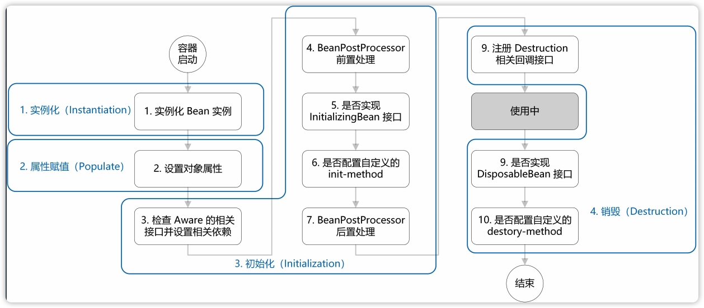

# 第9课 Java相关框架-Spring

* 控制心态
* 作业完成最低标准
* 不要拖拖拖
* 课程关注的是广度，深度还需要自己去学习
* 更多时间用在学习上，相信

## Spring技术发展

* 04年1.0版本发布
* 06年10月发布2.0版本
* 13年4月，Spring转移到Pivotal

> Rod Johnson，音乐学博士，《J2EE Development without EJB》，Spring作者。
> Pivotal有很多开源的项目，如Redis、RabbitMQ、平台即服务的 Cloud Foundry、Greenplum 数据引擎、 GemFire（12306 系统解决方案组件之一）。
> GemFire: 金融领域的分布式缓存，12306系统解决方案组件之一。

### Spring里程碑版本

* 2.5.6
* 3.3.1
* 4.X

> 在实际项目时，没必要使用最新的版本，使用最稳定的，最新的版本未必稳定，除非新版本有你需要的新特性。

## Spring框架设计

### 什么是框架

解决一些问题的集合，框架不直接解决业务本身问题。

组件：业务组件解决业务问题，比如用户组件解决用户问题；技术组件不是为了解决业务问题，如日期组件。

**架构和框架**

架构：架构是一个方法论，对特定的目标或问题的通用解决方案，应用的骨架，如房子的设计图。MVC架构。
框架：是整个或部分系统的可重用设计，解决方案的具体实现，如盖房子的钢结构。SprigMVC框架。

### Spring框架

Spring框架用来管理应用中的对象，以及划分系统层次，应用通过这种划分方式进行开发。

### Spring特征

* Core: 核心技术，包括依赖注入、i18n、类型转换、AOP
* Testing: 测试，包括Spring MVC Test，TestContext framework，mock Object，WebTestClient。
* DataAccess: 数据访问，包括事务，DAO支持，JDBC，ORM。
* Spring MVC和 Spring WebFlux Web框架
* Integration: 集成，包括JMS，email，cache等，对接不同的软件，如redis，jms。
* Languages: 多语言支持，如Kotlin，Groovy，dynamic languages。

### Spring核心模块

* spring-core：Spring基础API模块，如资源管理，泛型处理
* srping-beans：Spring Bean相关，如依赖查找，依赖注入
* spring-aop：Spring AOP处理，如动态代理，AOP字节码提升
* spring-context：事件驱动，注解驱动，模块驱动等
* spring-expression：spring表达式语言模块

> 半自动化的ORM和全自动ORM
> ORM是Object和Relation之间的映射，包括Object->Relation和Relation->Object两方面。Hibernate是个完整的ORM框架，是全自动ORM框架，而MyBatis完成的是Relation->Object，属于半自动ORM框架。
> JVM支持动态语言，多种语言。
> 静态语言：静态语言是在编译时变量的数据类型就可以确定的语言，多数静态类型语言要求在使用变量之前必须声明数据类型。 如C++、Java、C#等。
> 动态语言：是指在运行时确定数据类型的语言，变量使用之前不需要指定类型，通常变量的类型是被赋值的那个值的类型。如PHP，JavaScript、Ruby、Python。

### Spring框架设计

引入Spring意味着引入了一种研发协作模式，因为Spring可以把各个类管理为组件，所以可以将复杂的业务操作，进行切分（水平切分、垂直切分），让开发者更好的分工协作，各自开发负责的功能模块，在需要时调用对应组件就好了。

## Spring AOP详解

### Spring AOP

* AOP-面向切面编程

  Spring早期的核心功能，管理对象的生命周期和对象装配。为了实现bean的管理和装配，需要通过添加一个中间层（字节码增强）来实现所有对象的托管。

* IOC-控制反转
  
  也称为DI（Dependency Injection）依赖注入。

  从对象A直接引用和操作对象B，变成对象A里指需要依赖一个接口IB，系统启动和装配 阶段，把IB接口的实例对象注入到对象A，这样A就不需要依赖一个IB接口的具体实现， 也就是类B。通过这种方式就可以实现在不修改代码的条件下，替换IB的实现类，完成另外一个不同的业务逻辑。

**什么类型的循环依赖Spring无法处理？**

对于构造器注入的循环依赖Spring一般无法处理，引入如果要创建A类需要先有B类，B类有依赖A类。对于属性注入的循环依赖Spring可以处理：可以先创建A类和B类的实例，当使用到A类时再注入B类，同样在使用到B类时再注入A类。

> 除了Spring，其他类似的循环依赖：比如线程锁的循环依赖，解决方式一般是强制释放循环依赖中的一个线程的锁，让其他线程可以执行；或者在线程中设置超时，超过指定时间获取不到锁的时候主动结束线程。数据库的锁也是如此。

**AOP实现的方式**

对于接口类型，默认使用JdkProxy，代理后的class为com.sum.proxy.$ProxyXXX。也可以指定Spring参数`proxyTargetClass=true`使用CGlib代理。

对于非接口类型，默认使用CGlib，代理后的类为EnhancerBySpringCGLIB，这种代理方式是通过继承被代理类实现的，所以代理后的类是被代理类的子类。

> content.getDefNames: 获取加载的bean列表

### 字节码增强工具

Spring默认使用的是CGLib。

**字节码增强和反射的区别：**

* 反射不会改变类原有的字节码和结构。
* 字节码增强，在运行期生成字节码文件的方式，对类做增强，会改变类的字节码结构。

**常用的AOP工具**

* CGLIB：使用ASM实现。
* ASM
* AspectJ
* Java Proxy
* Javassist
* Instrumentation: 在类被classLoader加载之前改变字节码的内容。
* ByteBuddy: 比较常用的字节码增强的新工具，提供了更友好的操作API。半结构化的字节码工具，原先的字节码工具在改变字节码时是一个指令一个指令的拼接，比如iload、istorage等，ByteBuddy是一个命令的形式拼接，比如new。

> Instrumentation jdk6提供的口子，Java Agnet，在类被classLoader加载之前改变字节码的内容。
> 其他AOP，通过使用时进行动态代理。
> ByteBuddy，字节码增强新工具：更进化的字节码增强工具。
> 现在经常是Instrumentation+ByteBuddy结合使用。
> APM: 全链路追踪

## Spring Bean生命周期

* BeanFactory是最初的主要类，后面都是围绕BeanFactory衍生的。
* ApplicationContext: 应用上下文。Spring启动时会new它的实例。常见的ApplicationContext：ClassPathXmlApplictionContext, WebApplicationContext。

### Bean的加载过程

构造函数 --> 依赖注入 --> BeanNameAware --> BeanFactoryAware --> ApplicationContextAware --> BeanPostProcessor前置方法 --> InitializlingBean --> 自定义init方法 --> BeanPostProcessor后置方法 --> 使用 --> DisposableBean --> 自定义destory()方法

* 1.通过构造器创建对象
* 2.根据对象需要的属性执行依赖注入
* 3.如果实现了BeanNameAware，设置beanName
* 4.如果实现了BeanFactoryAware，注入beanFactory实例
* 5.如果实现了ApplicationContextAware，注入applicationContext实例
* 6.执行BeanPostProcessor前置方法
* 7.如果实现了InitializlingBean，执行对应的初始化方法
* 8.执行自定义的init方法
* 9.执行BeanPostProcessor后置方法
* 10.使用
* 11.如果实现了DisposableBean，执行对应的销毁方法
* 12.执行自定义的destory方法



**为什么设计得这么复杂？**

spring是为了让beanFactory更好的通用，在bean实例化时提供多个扩展可以让用户灵活控制bean实例化的过程。

> 在Bean工厂中，负责让Bean的定义转换成Bean的实例。

类加载代码：org.springframework.beans.factory.support.AbstractAutowireCapableBeanFactory#doCreateBean

```java
	protected Object doCreateBean(final String beanName, final RootBeanDefinition mbd, final Object[] args)
			throws BeanCreationException {

		// 实例化
		BeanWrapper instanceWrapper = null;
		if (mbd.isSingleton()) {
			instanceWrapper = this.factoryBeanInstanceCache.remove(beanName);
		}
		if (instanceWrapper == null) {
			instanceWrapper = createBeanInstance(beanName, mbd, args);
		}
		// ...

		// 初始化bean
		Object exposedObject = bean;
		try {
            // 装配bean
			populateBean(beanName, mbd, instanceWrapper);
			if (exposedObject != null) {
                // 初始化bean
				exposedObject = initializeBean(beanName, exposedObject, mbd);
			}
		}
		catch (Throwable ex) {
			if (ex instanceof BeanCreationException && beanName.equals(((BeanCreationException) ex).getBeanName())) {
				throw (BeanCreationException) ex;
			}
			else {
				throw new BeanCreationException(
						mbd.getResourceDescription(), beanName, "Initialization of bean failed", ex);
			}
		}
		// ...

		// 注册销毁方法
		try {
			registerDisposableBeanIfNecessary(beanName, bean, mbd);
		}
		catch (BeanDefinitionValidationException ex) {
			throw new BeanCreationException(
					mbd.getResourceDescription(), beanName, "Invalid destruction signature", ex);
		}

		return exposedObject;
	}

	protected Object initializeBean(final String beanName, final Object bean, RootBeanDefinition mbd) {
        // 执行实现的Aware方法
		if (System.getSecurityManager() != null) {
			AccessController.doPrivileged(new PrivilegedAction<Object>() {
				@Override
				public Object run() {
					invokeAwareMethods(beanName, bean);
					return null;
				}
			}, getAccessControlContext());
		}
		else {
			invokeAwareMethods(beanName, bean);
		}
        // 执行BeanPostProcessor前置方法
		Object wrappedBean = bean;
		if (mbd == null || !mbd.isSynthetic()) {
			wrappedBean = applyBeanPostProcessorsBeforeInitialization(wrappedBean, beanName);
		}
        // 执行bean的init方法
		try {
			invokeInitMethods(beanName, wrappedBean, mbd);
		}
		catch (Throwable ex) {
			throw new BeanCreationException(
					(mbd != null ? mbd.getResourceDescription() : null),
					beanName, "Invocation of init method failed", ex);
        }
        // 执行BeanPostProcessor后置方法
		if (mbd == null || !mbd.isSynthetic()) {
			wrappedBean = applyBeanPostProcessorsAfterInitialization(wrappedBean, beanName);
		}
		return wrappedBean;
	}

```

## Spring XML配置原理

### XML配置原理

* 1.通过xmnls属性定义自定义标签的名称：

```xml
<beans xmlns:context="http://www.springframework.org/schema/context" ...> ... </beans>
```

* 2.通过xsi:schemaLocation属性定义xsd文件的位置：

```xml
<beans ... 
    xsi:schemaLocation="http://www.springframework.org/schema/context
                        http://www.springframework.org/schema/context/spring-context-3.2.xsd" ...> ... </beans>
```

* 3.META-INF/spring.schemas文件内指定xsd文件的位置：

```text
http\://www.springframework.org/schema/context/spring-context-3.2.xsd=org/springframework/context/config/spring-context-3.2.xsd
```

* META-INF/spring.handlers配置从DOM节点parse对象的bean：

```text
http\://www.springframework.org/schema/p=org.springframework.beans.factory.xml.SimplePropertyNamespaceHandler
```

> xsd文件用来检查XML配置是否正确。

### 自动化XML配置工具

XmlBeans -> Spring-xBean

Spring-xbean在XmlBeans上封装而来，用来简化上面自定义标签的实现方式，可以根据bean的属性自动生成xsd文件以及parse对象。

* 根据Bean的字段结构，自动生成XSD。
* 根据Bean的字段结构，配置XML文件。

> XmlBeans：Apache下的用来xml和bean进行转换的工具。

### Spring Bean配置方式演化

* 1.0/2.0版本，只支持通过XML/@Autowire，实现XML配置/注解注入。
* 2.5版本，通过@Service支持半自动注解配置。
* 3.0版本，通过@Bean、@Configuration，实现Java Config配置方式。
* 4.0/SpringBoot，通过@Condition、@AutoConfigureXX，实现全自动注解配置。

## Spring Messageing等技术

**MQ相比于RPC的优势**

* 同步转异步
* 依赖关系变简单

介绍Messageing与JMS

JMS是J2EE规范。

> kafka、rocketmq原生都不支持JMS，但是有第三方的实现库可以适配JMS。
> JMS是j2ee的规范，全称Java Message Service。

## Tips

* 软件工厂很多术语都是从建筑工程来的，建筑师=架构师。

* 计算机的所有问题都可以通过添加一个中间层解决。如CPU和内存之间添加L1cache。

## 参考

* [APM](https://www.cnblogs.com/xiaoqi/p/apm.html)
* DispatcherServlet springMVC的核心类
