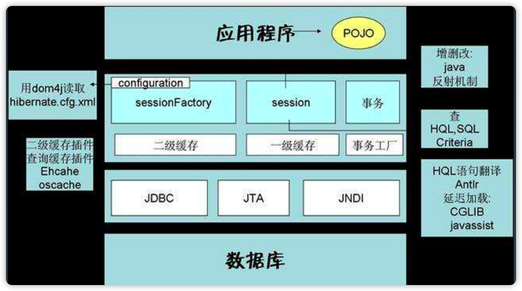

# 第10课 Java相关框架-Spring Boot

## 从Spring到Spring Boot

### Spring变得越来越复杂

最多的时候有100多个项目，配置越来越复杂。

### Spring Boot的出发点

Spring臃肿之后的必然选择，一切都是为了简化。让开发变得简单，让配置变得简单，让运行变简单。

**SpringBoot做的事情就是将Spring从一个限定性框架转换成一个非限定性框架。基于什么变得简单：约定大于配置。**

> 限定性框架：可能是针对特定场景的框架，在对应的场景是最佳实践。
> 非限定性框架：万金油，在不同的场景下都适应，但是不一定是最佳实践。SpringBoot就是非限定性框架。

### Spring Boot

SpringBoot是Spring的一套快速配置脚手架，关注于自动配置、配置驱动。

**为什么能做到简化：**

* Spring本身技术的成熟与完善，各方面第三方组件的成熟集成。
* Spring团队在去web容器化等方面的努力。SpringBoot做的第一件事是实现了嵌入式的tomcat。
  SpringBoot内置了tomcat。
* 基于maven与pom的Java生态体系，整合pom模板成为可能。
* 避免大量maven导入和各种版本冲突。

> jetty和tomcat的关系和区别，jetty本身就是嵌入式的web容器，
> 脚手架和解决方案
> spring data flow，是现在以及未来spring的主要关注点。

官方定义：

Spring Boot 使创建独立运行、生产级别的 Spring 应用变得容易，你可以直接运行它。SpringBoot对 Spring 平台和第三方库采用限定性视角，以此能在最小的成本下上手。大部分 Spring Boot 应用仅仅需要最少量的配置。

特点：

* 创建独立运行的Spring应用。
* 直接嵌入Tomcat或Jetty、Undertow，无需部署war包。**使用Maven插件shade也可以实现该功能。**
* 提供限定性的starter依赖简化配置（就是脚手架），默认提供了100多个starter。
* 在必要的时候自动化配置Spring和其他第三方依赖库。
* 提供生产production-ready特性，例如指标度量，健康检查，外部配置等。
* 完全零代码生成和完全不需要xml配置。

### 快速构建基础maven项目

https://start.spring.io/

## Spring Boot核心原理

### Spring Boot两大核心原理

* 自动化配置：简化配置核心

  基于Configuration，EnableXX，Condition

* spring-boot-starter：脚手架核心
  
  整合各种第三方类库，协同工具。

### 实现方式

通过在application.yaml进行属性配置，Configuration注解会获取这些配置项，然后生成对应的bean。其中根据application.yaml配置属性的前缀，可以生成一组配置，这组配置可以被不同的Starter组件使用。

### 为什么要约定大于配置

举例：JVM有1000多个参数，但是我们不需要一个参数就可以java Hello。

优势在于，开箱即用：

* Maven 的目录结构：默认有 resources 文件夹存放配置文件。默认打包方式为 jar。
* 默认的配置文件：application.properties 或 application.yml 文件。
* 默认通过 spring.profiles.active 属性来决定运行环境时的配置文件。
* EnableAutoConfiguration 默认对于依赖的 starter 进行自动装载。
* spring-boot-start-web 中默认包含 spring-mvc 相关依赖以及内置的 web容器，使得
构建一个 web 应用更加简单。

> maven也有profile，在打包时指定配置文件打包到jar中。springboot的profile，配置文件是全部在jar中，通过指定spring.profiles.active使用不同的配置。

### 自动化配置原理

* 在启动类上添加启动自动化配置注解@EnableAutoConfiguraton

  ```java
  @SpringBootApplication
  @ComponentScan("com.wkk.learn.springboot.autoconfig")
  public class AutoconfigDemo {

      public static void main(String[] args) {
          SpringApplication.run(AutoconfigDemo.class, args);
      }
  }
  ```

* 在配置类上添加@Configuration注解

  ```java

  @Configuration
  public class AutoconfigConditionalSpring{

      @Bean
      public static AutoconfigBeanFactoryPostProcessor greetingBeanFactoryPostProcessor() {
          return new AutoconfigBeanFactoryPostProcessor();
      }
  }
  ```

* 在META-INF/spring.factories中配置自动配置类

  ```text
  org.springframework.boot.autoconfigure.EnableAutoConfiguration=\
  com.wkk.learn.springboot.autoconfig.conditional.AutoconfigConditional
  ```

### Spring Boot自动配置注解

* @SpringBootApplciation
  SpringBoot 应用标注在某个类上说明这个类是 SpringBoot 的主配置类，SpringBoot 就会运行这个类的 main 方法来启动 SpringBoot 项目。这个注解还组合了下面的注解：
  * @SpringBootConfiguration: 配置SpringBoot默认的配置
  * @EnableAutoConfiguration: 启动自动配置
  * @AutoConfigurationPackage: 自动扫描包
  * @Import({AutoConfigurationImportSelector.class}): AutoConfigurationImportSelector会将当前需要自动配置的类选择出来进行自动化配置。

加载所有 META-INF/spring.factories 中存在的配置类（类似 SpringMVC 中加载所有 converter）

### 条件化自动配置

@ConditionalOnBean
@ConditionalOnClass
@ConditionalOnMissingBean
@ConditionalOnProperty
@ConditionalOnResource
@ConditionalOnSingleCandidate
@ConditionalOnWebApplication

## Spring Boot Starter详解

通过自定义的自动配置类实现对自定义bean的创建。

## JDBC与数据库连接池

### JDBC

JDBC是java定义的数据库接口，只有接口没有实现，需要各个数据库厂商实现。

DriverManager
Connection
Statement
ResultSet
后来追加DataSourccePool

### JDBC 是 Java 里操作数据库的核心

Java操作数据库的各种类库，都可以看做是在JDBC上做的增强实现。

增强的举例：接口Connection --> MySQL驱动JDBC接口Connection --> 从连接池获取的PooledConnection --> 加上XA事务的XAConnection。

通过代理数据库驱动实际的Connection，在调用conection.create()/close()不是真正创建连接而是从缓冲中获取或者还给连接池。**所有对数据库做的拦截和增强都是通过在上面的基础类上做增强（AOP）实现的。**

> DbUtils: Apache提供的一个开源JDBC工具类库，专门操作数据库。

### 数据库连接池

C3P0
DBCP: 基于Apache CommonPool
Druid
Hikari

> 连接池的快慢对程序影响不大，JSON序列化等也影响不大。
> 连接池、字节码工具、JSON序列化这三个对程序的性能影响都不大。

## ORM-Hibernate/MyBatis

ORM(Object-Relational Mapping)表示对象关系映射。

### Hibernate

Hibernate是一个开源的对象关系映射框架，对JDBC进行了轻量级的对象封装，它将POJO与数据库表建立映射关系，是一个全自动的ORM框架。Hibernate可以自动生成SQL语句，可以使用面向对象的方式来操作数据库。

Hibernate支持HQL、Ciriteria、NativeSQL三种方式操作数据库。

Hibernate 里需要定义实体类和 hbm 映射关系文件（IDE 一般有工具生成），还可以根据实体类生成对应的表结构。

也可以作为 JPA 适配实现，使用 JPA 接口操作。



### Mybatis

支持定制化SQL、存储过程以及高级映射。MyBatis避免了几乎所有的JDBC代码和手动设置以及获取结果集。

* 需要使用映射文件 mapper.xml 定义 map规则和 SQL。
* 需要定义 mapper/DAO，基于 xml 规则，操作数据库。

可以使用工具生成基础的 mapper.xml 和 mapper/DAO。

### MyBatis 与 Hibernate 比较

Mybatis优点：原生SQL（XML语法），直观，对DBA友好，SQL优化方便。
Hibernate优点：简单场景不用写SQL（HQL、Cretiria、SQL），开发速度快，使用HQL的话数据库移植性好。

Mybatis缺点：繁琐，可以用Mybatis-gennerator、MyBatis-Plus之类的插件，数据库移植性不好。
Hibernater缺点：对DBA不友好，显示不够直观，SQL不好优化。

## Spring集成ORM与JPA

### JPA

早期Java没有ORM的概念，Hibernate流行后，Java借鉴Hibernate的概念，提出了JPA。

JPA全称Java Persistence API，即Java持久化API，是一套基于ORM的规范，内部是由一系列的接口和抽象类构成。

**核心是EntityManager：实体类的管理器。** EntityManager除了不支持HQL，其他和Hibernate一样。通过EntityManager获取到实体类可以进行保存更新等操作数据库。

### Spring JDBC与ORM

Spring JDBC可以直接支持Spring自己的JdbcTemplate（Spring实现的ORM框架），也可以支持Hibernate、Mybatis。
Spring ORM核心就是来支持JPA，在JPA上进行了一层包装。

### Spring事务管理

JDBC层在进行数据访问时，只能使用编程式事务。

Spring通过声明式事务管理（事务管理器 + AOP）实现无侵入实现事务。


**Spring 声明式事务配置参考**

事务的传播性：
@Transactional(propagation=Propagation.REQUIRED)
事务的隔离级别：
@Transactional(isolation = Isolation.READ_UNCOMMITTED)
读取未提交数据(会出现脏读, 不可重复读) 基本不使用
只读：
@Transactional(readOnly=true)
该属性用于设置当前事务是否为只读事务，设置为 true 表示只读，false 则表示可读写，默认值为 false。
事务的超时性：
@Transactional(timeout=30)
回滚：
指定单一异常类：@Transactional(rollbackFor=RuntimeException.class)
指定多个异常类：@Transactional(rollbackFor={RuntimeException.class, Exception.class})

### Spring/Spring Boot使用ORM的经验

* 本地事务（事务的设计与坑）
  调用没有被Spring增强的类的时候事务不会起作用。
* 多数据源（配置、静态制定、动态切换）
* 数据库连接池配置（大小、重连、超时）
  数据库连接池设置的小的时候会有奇效，连接池太大会有问题。
  在连接池上一定要添加心跳、重连机制。
* ORM内的复杂SQL，级联查询。
* ORM辅助工具和插件，分页插件导致的查询慢问题。

## Tips

* fastjson不是标准的json格式，错误的json也有可能转成正确的json。为什么不能修改，因为有大面积的使用，如果改了很多项目会用不了。
