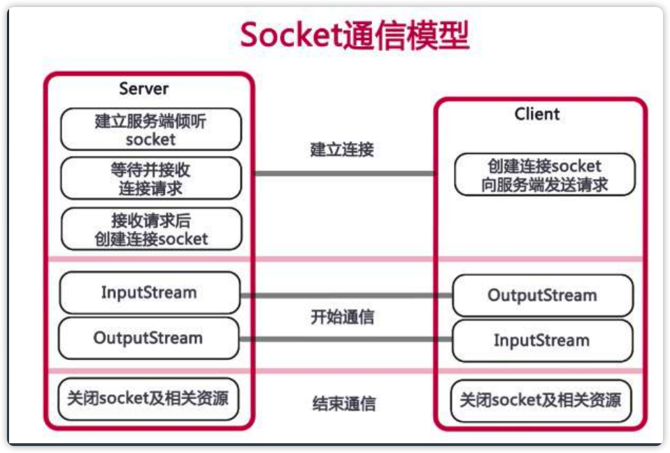
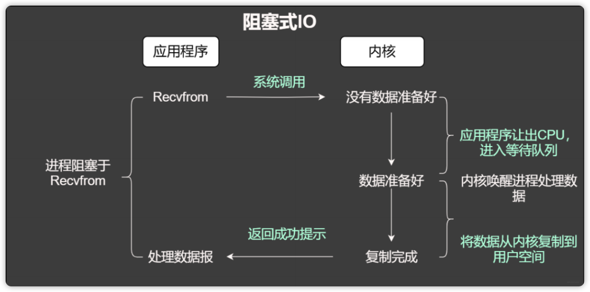
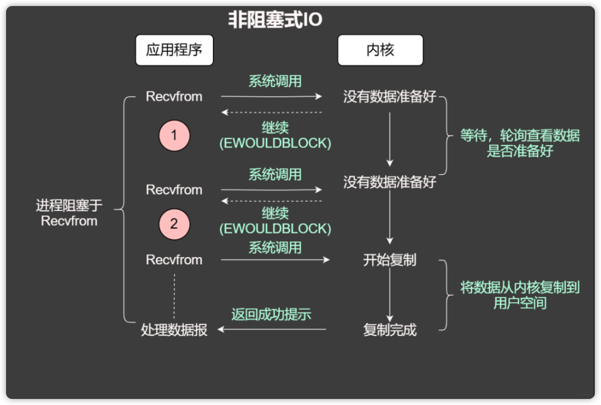
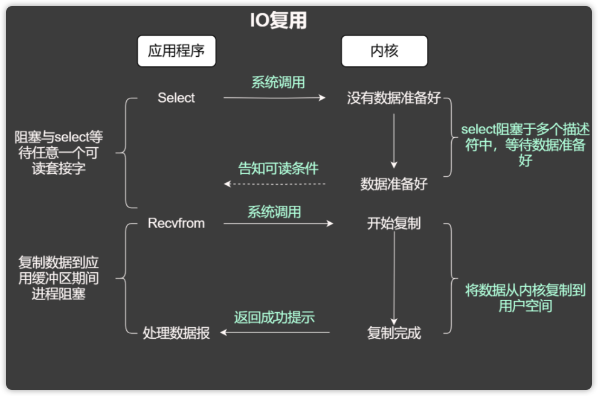
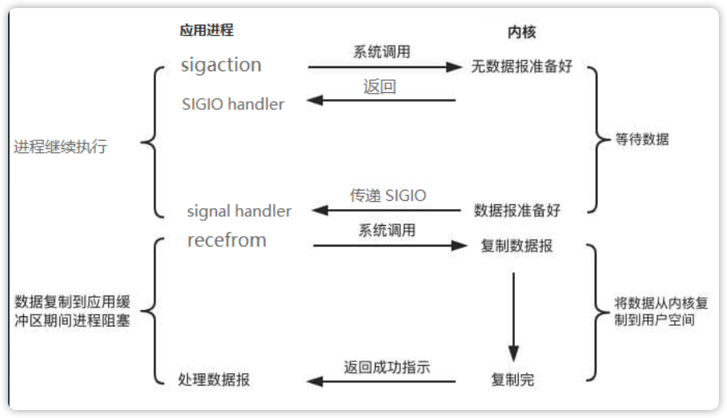

# 第 4 课 NIO模型与Netty入门

xmind：Socket编程.xmind

## Socket编程

### Socket通信模型

### 服务器通信过程分析

**通信过程中的操作**

在Socket通信过程中，主要存在两种类型的操作：CPU计算/业务处理；IO操作与等待/网络、磁盘、数据库等。

**通信过程中的问题**

* 对于IO相关的应用来说，一个请求进来时，主要是在读取服务器上的数据，然后再发送出去，这种情况下，应用的CPU占用很少，大部分CPU等资源就可能被浪费了。
这种优化方式可以通过使用线程池，每次处理大量请求。还可以再优化

* 深入到系统级别，每次应用发送或者获取数据时，涉及到内核态到用户态和用户态到数据态的数据复制，这个数据复制过程也是影响并发的原因。
优化方式：可不可以直接跨过内核态发送数据，或者省去数据复制的过程。

### IO模型

#### 阻塞IO模型（同步）

   会在用户线程读写数据过程中发生阻塞。
  

#### 非阻塞IO模型（同步）

  在用户线程进行读请求时，不需要等待会立刻返回一个结果。如果结果是数据还没准备好，会再次发送读请求，直到数据准备好。
  

#### IO复用模型（同步）

  在单个线程中同时监听多个socket，不断去轮询多个socket的状态，只有当socket有读写事件时，才通知用户进程。
  

**IO多路复用的优点**

* 只使用一个线程管理多个Socket，减少了多线程的开销。
* 只有当Socket有读写事件时才会占用资源来进行实际的读写操作。

**IO多路复用的实现**

* select：select是第一个IO多路复用的实现（1983年）

select实现的缺点是：

* 每次调用select，都需要把fd集合从用户态拷贝到内核态，这个开销在fd很多时会很大。
* 同时每次调用select都需要在内核遍历传递进来的所有fd，这个开销在fd很多时也很大。
* select如果任何一个socket有数据了，select仅仅只是返回，不会告诉是哪个socket上有数据，只能遍历查找。
* select支持的文件描述符数量太小了，只能监听1024个链接。

* poll：1997年的实现，poll 去掉了1024个链接的限制。

* epoll：2002年出现，Linux 2.5.44内核中引入，2.6内核正式引入，用于代替POSIX select和poll系统调用。epoll 修复了poll 和select绝大部分问题, 比如：
  epoll内核与用户空间共享一块内存。
  epoll现在是线程安全的。
  epoll通过回调解决遍历问题，现在不仅告诉你sock组里面数据，还会告诉你具体哪个sock有数据，你不用自己去找了。
  fd没有限制，可以支撑10万连接。

#### 信号驱动的IO模型（同步）

用户进程需要等待数据时，会向内核注册一个信号函数，然后用户进程会继续执行，当内核数据就绪时会发送一个信号给用户进程，用户进程收到信号后立刻调用recvfrom，去获取数据。

#### 异步IO模型（同步）

异步 IO 真正实现了 IO 全流程的非阻塞。用户进程发出系统调用后立即返回，内核等待数据准备完成，然后将数据拷贝到用户进程缓冲区，然后发送信号告诉用户进程 IO 操作执行完毕（与 SIGIO 相比，一个是发送信号告诉用户进程数据准备完毕，一个是 IO执行完毕）。

目前很少有Linux系统支持，Windows的IOCP就是该模型。

#### 5种IO模型的比较

阻塞程度：阻塞IO > 非阻塞IO > IO复用 >  信号驱动IO > 异步IO，效率由低到高。

> tips: 文件描述符，也叫文件句柄。文件描述符是内核为了高效管理已被打开的文件所创建的索引，是一个非负整数，用于指代被打开的文件。`ulimit -n`可以查看单个进程能够打开的最大文件句柄数量。系统默认是1024。**在服务器运⾏Netty时，需要去解除⽂件句柄数量的限制，修改/etc/security/limits.conf⽂件即可。**

## io模型的发展

目前高性能服务器底层的线程模型

线程池-->EDA（事件驱动架构）--> SEDA（分阶段的时间驱动架构）

* 线程池：传统的线程模型，并发有瓶颈，并发和线程池的大小到了一定数量成反比。

* EDA：用户线程发起信号事件，系统接收信号处理，处理完成后再发送一个处理完成的信号事件，用户线程接收信号事件继续接下来的处理，通过事件进行姐耦。

* SEDA：多个线程池+EDA。

## Netty框架简介

### Netty是什么

Netty是基于异步和时间驱动的网络应用程序框架，通过它可以快速开发、高性能、高可扩展的服务器应用和客户端应用。

Netty的特性是：高吞吐、低延迟、低开销、零拷贝、可扩容。基于jdk5，兼容大部分通用协议，并且支持自定义协议。

### Netty的基本概念

* Channel：通道，代表网络连接，可以执行写入/读取操作。
* ChannelFuture：由于JUC提供的Future只允许手动检查对应的操作是否完成，或者一直阻塞到它完成。所以Netty进行封装实现了ChannelFuture，用于在异步操作的时候使用。由ChannelFutureListener提供的通知机制消除
了手动检查对应的操作是否完成的必要。
* Event & Handler：Netty 基于事件驱动，事件和处理器可以关联到入站和出站数据流。
* Encoder & Decoder：处理网络IO时，需要进行序列化和反序列化，转换Java对象与字节流。对入站数据进行解码，基类是ByteToMessageDecoder。对出站数据进行编码，基类是MessageToByteEncoder。
* ChannelPipeline：数据处理管道就是事件处理器链。有顺序、同一 Channel 的出站处理器和入站处理器在同一个列表中。

## Tips

> Netty底层代码可能不是很好懂，越通用的代码，性能可能越不突出。
> 端口和ip：ip用于定位主机，端口定位主机上的进程。一个进程可以有多个端口，一个端口可以有多个进程。
> 典型的应用分为两种IO密集型系统和CPU密集型应用。
> 压力测试：window上注意端口，linux上注意句柄。

## 参考

* [IO 多路复用是什么意思？](https://www.zhihu.com/question/32163005)