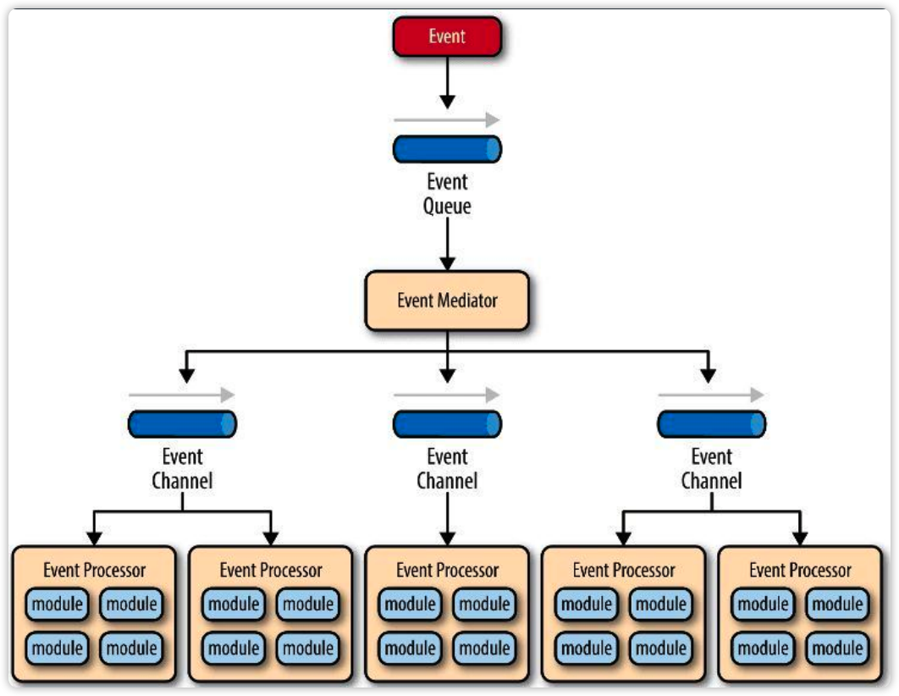
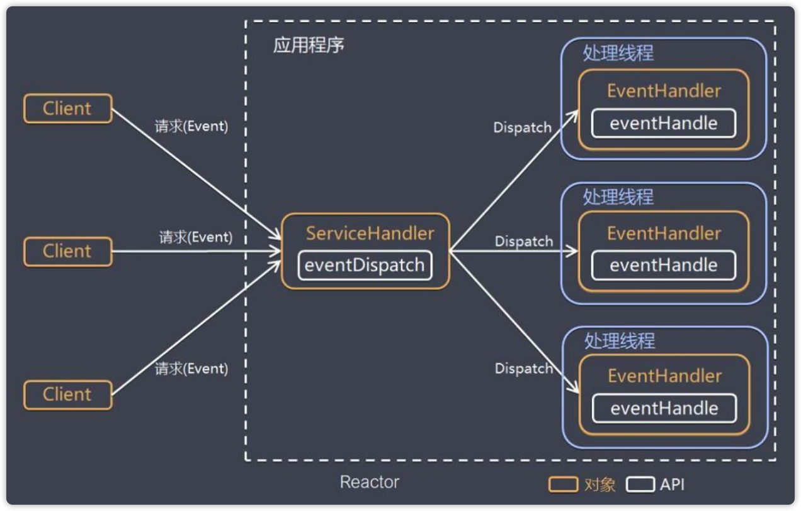
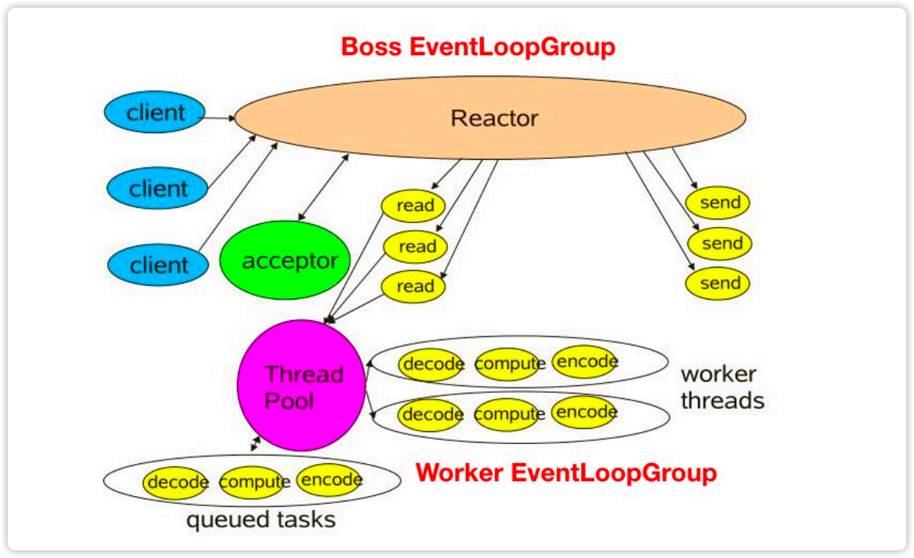
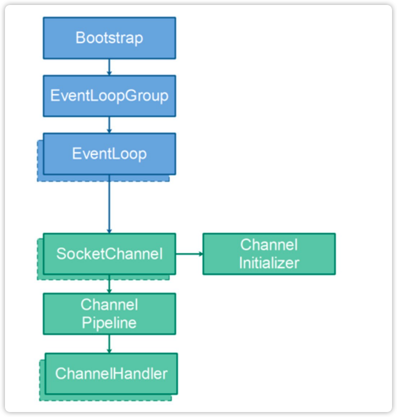
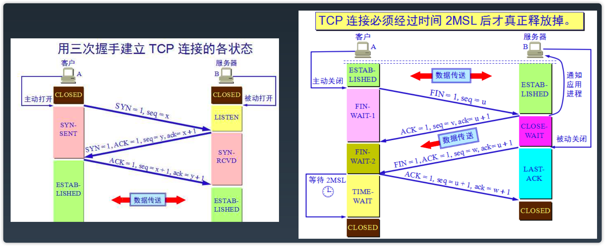

# 05-Netty原理与API网关

## 高性能

### 什么是高性能

* 高并发用户（Concurrent Users）：从业务外部衡量，属于业务指标。
* 高吞吐量：QPS（每秒查询），TPS（每秒事物操作），系统内部，属于技术指标。
* 低延迟： 也属于技术指标。

```text
~ % wrk -c 40 -d 30s --latency http://127.0.0.1:8808/test
Running 30s test @ http://127.0.0.1:8808/test
  2 threads and 40 connections
  Thread Stats   Avg      Stdev     Max   +/- Stdev
    Latency   686.85us    6.80ms 177.27ms   99.46%
    Req/Sec    78.15k     8.27k   85.22k    94.67%
  Latency Distribution
     50%  237.00us
     75%  255.00us
     90%  281.00us
     99%  786.00us
  4666008 requests in 30.10s, 485.03MB read
Requests/sec: 154995.03
Transfer/sec:     16.11MB
```

说明：

`-c 40`是并发数；`Requests/sec: 154995.03`如果是查询就是QPS；如果是事物操作就是TPS。`Latency Distribution`表示的是响应时间。

**延迟(Latency)和响应(Response Time)时间的关系：**

用户从发起请求到接收到响应的时间称为响应时间。系统接收到请求开始处理到处理完成发送响应的时间称为延迟。响应时间是相对于用户或者调用者，受网络的影响。延迟时间是相对于系统内部的，延迟时间对于每个请求来说是差不多的。

### 高性能的副作用

* 系统复杂度：为了实现高性能要引入更多的东西。

* 建设和维护成本提高。

* 故障或BUG导致的破坏性更大：性能越高故障破坏性越大。

**应对策略：**

稳定性建设（混沌工程）：

* 1.容量：清楚应用的最大负载，吞吐量、并发量等。

> 每天有86400秒，taobao每天有3000万TPS，美团滴滴大概1000万。支付宝在双十一最大的并发，前几分大概54万TPS每秒。三大云服务供应商：AWS， 微软，Aliyun。

* 2.爆炸半径：bug造成的影响。应对方式：应用拆分，微服务。

* 3.工程方法积累与改进：天灾人祸，超出认知的bug。

> 混沌工程(Chaos Engineering)：Netflix提出的，通过在整个系统中随机位置引发故障，帮助分布式系统提升容错性和可恢复性的混沌工程工具。ChaosBlade：阿里巴巴的混沌测试工具。

## Netty概览

网络应用开发框架：异步、事件驱动、基于NIO。适用于：服务端、客户端、TCP/UDP。

基于NIO：高并发量；事件驱动：API解耦；异步：高性能。

### 事件处理机制



事件处理机制的流程：

客户端发起请求事件（Event）--> 事件进入到事件队列（Event Queue）排队 --> 当轮到这个事件的时候，事件分发器（Event Mediator）将事件分发到事件通道（Event Channel）--> 事件通道（Event Channel）在调用事件处理器（Event Processor）处理。

### 从事件处理机制到Reactor模型



Reactor模式首先是事件驱动的，有一个或者多个并发输入源，有一个ServiceHandler和多个EventHandlers。
ServiceHandler负责将客户端请求hand住，然后将请求多路复用的分发给相应的Event Handler。ServiceHandler只负责一件事更高效。

### 从Reactor模型到Netty NIO



Netty有三种处理模型，上面是最复杂的一种。

Boss EventLoopGroup：负责接收客户端请求，再交给Worker EventloopGroup处理，数量较少。
Worker EventLoopGroup：负责处理客户端请求。

### Netty运行原理

EventLoop：可以理解成单线程循环。

### 关键对象



* Bootstrap：Netty的启动器，有两个ServerBootstrap和Bootstrap，一个用于服务端一个用于客户端。
* EventLoopGroup：一组EventLoop，如果将EventLoop理解成线程，这个就是线程池。
* EventLoop：可以理解成线程
* SocketChannel：网络相关
* ChannelInitializer：初始化，绑定处理链。
* ChannelPipeline：处理器链。
* ChannelHandler：处理器。

### ChannelPipeline

### Event & Handler

入站事件：

出站事件：

Netty应用的组成：网络事件，应用逻辑事件，事件处理程序

## Netty网络程序优化

### 粘包与拆包

TCP本身没有粘包和拆包的问题。

**Netty的ByteToMessageDecoder提供了一些实现用来解决粘包和拆包问题：**

* FixedLengthFrameDecoder: 定长协议解码器，可以指定固定长度字节数算一个完整的报文。
* LineBasedFrameDecoder: 行分隔符解码器，遇到\n或者\r\n，则认为是一个完整的报文。
* DelimiterBasedFrameDecoder：分隔符解码器，分隔符可以自己指定。
* LengthFieldBasedFrameDecoder：长度编码解码器，将报文划分为报文头/报文体。
* JsonObjectDecoder：json格式解码器，当检测到匹配数量的"{" 、”}”或”[””]”时，则认为是一个完整的json对象或者json数组。

> nginx也有类似的操作，不知道文件的大小的时候，会在响应的头部添加chuck...

### Nagle与TCP_NODELAY

**Nagle算法**

Nagle算法：当发送数据的缓冲区满了或者超过200ms了，就将数据发送出去，有点组提交的感觉。Nagle算法的优化条件是缓冲区满，达到超时。Nagle算法的目的是优化单个小的包的发送。

怎么避免这个优化：

* 可以将操作系统的这个优化关闭，当并发高的时候这个优化收益很大。
* 修改最大的传输单元（MTU: Maxitum Transmission Unit）和最大分段大小（MSS: Maxitum Segment Size）。最大传输单元一般1500byte；最大分段大小tcp下一般1460byte。

> 在代码中调用send()方法发生数据，这个操作只是调用操作系统底层的发生接口，最终发不发还要由操作系统决定。

### 连接优化



TCP三次握手，四次挥手。

在TCP断开连接的时候，四次挥手中的最后一次客户端需要等待2MSL才能将端口释放掉，Linux上默认1MSL=2分钟，Window上默认1MSL=1分钟。所以一次压力测试后可能在客户端看到很多在WAIT_TIMEOUT的端口。所以如果有大量的高并发请求，会有很多端口的状态在等待断开状态。

解决方式：

* 降低断开连接的等待周期，MSL的值。
* 开启端口复用功能，可以复用状态是TIME-WAIT的端口。

### Netty优化

* 1.不要阻塞EvnetLoop，因为EventLoop是单线程的。不要加同步锁，会导致单线程的轮询过程，相互之间被阻塞。

* 2.系统参数优化

  调整文件描述符的大小`ulimit -a`；
  调整TCP挥手等待周期的时间，Linux修改/proc/sys/net/ipv4/tcp_fin_timeout，Windows在注册表中修改参数TcpTimedWaitDelay。

* 3.缓冲区优化

  在Netty代码中调整下面参数：
  SO_RCVBUF（接收缓冲区）/SO_SNDBUF（发送缓冲区）/SO_BACKLOG（保持连接状态）/REUSEXXX（端口的重用）

  > SO_BACKLOG（保持连接数量）：用来控制在连接状态中的TCP连接的数量。linux和mac上默认值128，window上默认值200。
  > SO_REUSEADDR: 地址重用；SO_REUSEPORT: 端口重用。

* 4.心跳周期优化

  心跳机制与断线重连：用来检查客户端是否断开连接以及重连。心跳机制的频率要控制在适当范围内。

* 5.内存与ByteBuffer优化

  减少内核态和用户态的copy，使用DirectBuffer与HeapBuffer直接操作内存。

  > DirectBuffer: 直接内存，不需要内核态和用户态的copy；HeapBuffer: 使用堆内存，还需要内核态和用户态的copy。
  > Netty自己建立来类似GC的内存管理机制，每次使用后清空，可以复用。
* 6.其他优化

  * IoRatio: IO操作和非IO操作占用CPU时间的比例，默认是50:50。
  * Watermark：缓冲区水位，写满时的处理。
  * TrafficShaping：基于水位操作，对流量进行限流。

## 典型应用：API网关

### 网关的结构和功能

**网关的主要功能：**

* 请求接入：作为API接口服务请求的接入点。
* 业务聚合：作为后端业务跟服务的聚合点。
* 中介策略：实现安全、验证、路由、过滤、流控等策略。
* 统一管理：对所有API服务和策略进行统一管理。

### 网关的分类

流量网关：关注稳定与安全，提供日志统计、防止SQL注入、防止Web攻击、黑白名单等。例如：OpenResty，Kong。
业务网关：提供更好的服务，有服务级别流控、服务熔断与降级、路由与负载均衡、灰度策略、权限验证与用户等级策略、业务规则与参数校验、多级缓存策略。例如：Spring Cloud Gateway，Zuul2。

* Zuul

Netflix开源的API网关系统，主要设计目标是动态路由、监控、弹性、安全。

* Zuul2

基于Netty内核重构的版本。

* Spring Cloud Gateway

底层基于WebFlux，WebFlux基于Netty Reactor。功能更强大。