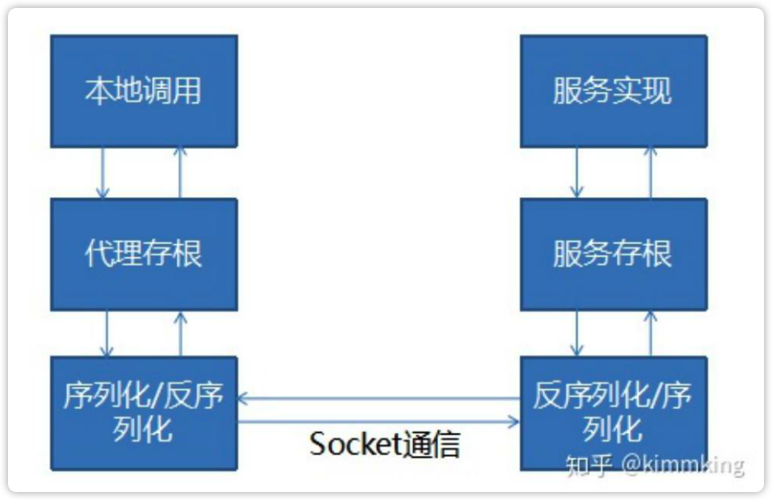

# 第 17 课 分布式服务-RPC与分布式服务化

## 1.RPC基本原理*

### RPC是什么

RPC(Remote Procedure Call): 远程过程调用。像调用本地方法一样调用远程方法。

> 二方库、三方库
> nexus/[ˈneksəs]/

### RPC原理

RPC的简化版原理如下：

核心是代理机制

* 本地代理存根：Stub
* 本地序列化反序列化
* 网络通信
* 远程序列化/反序列化
* 远程服务存根：Skeleton
* 调用实际业务服务
* 原路返回服务结果
* 返回给本地调用方

**注意处理异常**

> 现在所有的RPC的底层原理都是这个样子滴。

#### 设计

本地应用程序与远程应用程序，需要共享POJO实体类的定义和接口的定义。**注意这里是定义不是实现**

在Java程序中，可以使用jar包共享POJO实体类和接口。是通过代码的方式共享定义。
web service是使用SOAP定义POJO的实体类和接口，它使用的是xml的方式描述实体类和接口。

#### 代理

代理的目的是在访问远程接口方法的定义时，让它通过网络去访问远程的目标方法。

* 在Java里，代理可以选择动态代理，或者AOP实现
* C#直接有远程代理
* Flex可以使用动态方法和属性

#### 序列化

通过网络传输的数据需要序列化和反序列化。

序列化和反序列的选择：

* 语言原生的序列化，RMI（JMX，只能在Java中使用），Remoting（只能在.net中使用）
* 二进制的方式，Hessian，avro，kyro，fst等，
  使用二进制的好处是与平台无关，占用小，但是可读性差。现在比较通用的方式。
* 文本，JSON、XML等，和平台无关。
  可读性好，但是占用空间大。

> XML常见的方式XSD、DTD。

#### 网络传输

常见的传输方式：

* TCP/SSL

* HTTP/HTTPS

#### 查找实现类

通过接口查找服务端的实现类。

一般是注册的方式，例如dubo是将接口和实现类配置到Spring。

## 2.RPC技术框架*

### RPC技术框架

很多语言内置了RPC技术，比如Java的RMI， .NET的Remoting。

远古时期的尝试：

* Corba（Common ObjectRequest Broker Architecture）公共对象请求代理体系结构，面向对象模型的，由OMG接口描述语言(OMG Interface Definition Language， OMG IDL)、对象请求代理(Object Request Broker，ORB)和IIOP标准协议（Internet Inter­ ORB Protocol，也称网络ORB交换协议）3个关键模块组成。

* COM（Component Object Model，组件对象模型）是微软公司于1993年提出的一种组件技术，它是一种平台无关、语言中立、位置透明、支持网络的中间件技术。很多老一辈程序员心目中的神书《COM本质论》。

### 常见的RPC技术

* Corba/RMI/.NET Remoting
* JSON RPC, XML RPC，WebService(Axis2, CXF)
  WebService(Axis2, CXF)是描述比较完善，在二进制技术流行之前的比较流行的技术。
* Hessian, Thrift, Protocol Buffer, gRPC
  现在互联网流行的技术，占用内存小。

## 3.如何设计一个RPC*

### 自己设计一个RPC

设计一个RPC需要考虑的问题：

* 基于共享接口还是IDL？
* 动态代理 or AOP？
* 序列化用什么？文本 or 二进制？
* 基于TCP还是HTTP？

## 4.从RPC到分布式服务化

### 从RPC走向服务化->微服务架构

* 多个相同的服务如何管理
* 服务注册与发现机制
* 如何负载均衡，路由等集群功能
* 熔断、限流等治理能力
* 重试等策略
* 高可用、监控、性能等等。

**一个典型的分布式服务化架构**

## Tips

* rest-API, JSON-API 也是RPC
* websocket和http的关系，websocket是在http的上面进行流的传输，在http连接的上面进行了升级，升级之后的连接和http已经没有什么关系了。在传输的时候会提添加一个头部 http upgrade表示http要升级成websocket。
* 柔性事务的本质是乐观锁。假设回滚是一个小概率事件。XA分布式事务是一个大事务。
* 分布式事务的隔离级别：
