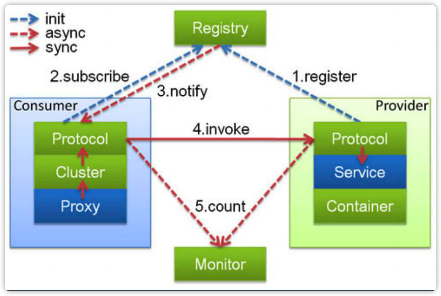

# 第18课 分布式服务-Dubbo技术详解

## 1.Dubbo框架介绍*

### Dubbo的发展历史

开源期（2011-2013，横空出世）：Dubbo是阿里巴巴B2B开发的，2011年开源。
沉寂期（2013-2017，潜龙在渊）：2013年到2017年，dubbo维护程度很低。
复兴期（2017-2019，朝花夕拾）：2017年8月份重启维护，2018年2月加入Apache孵化器，2019年5月顺利毕业。

Dubbo产生于阿里巴巴的B2B实际业务需求，随着B2B退市，淘系的HSF的使用，导致Dubbo停滞。

> 在Apache孵化器中的项目，一般一年半就会毕业，如果一年半不能毕业基本上就很难毕业了。
> 当当、京东等公司的服务化都是基于Dubbo实现的，四大行都有使用。当当的DubboX，京东的jsf。
> Dubbo和Spring Cloud的关系类似于IE浏览器与Chrome浏览器的故事。

### Dubbo的主要功能

Apache Dubbo是一个高性能、轻量级的开源的Java服务框架。

六大核心能力：

* 面向接口代理的高性能RPC调用
  提供高性能的基于代理的远程调用能力，服务以接口为粒度，为开发者屏蔽远程调用底层实现细节。
* 智能负载均衡
  内置多种负载均衡策略，智能感知下游节点的健康状况，显著减少调用延迟，提高系统吞吐量。
* 服务自动注册与发现
  支持多种注册中心，服务上线下线实时感知。
* 高度可扩展能力
  遵循微内核+插件的设计原则，所有核心能力，如Protocol、Transport、Serialization被设计为扩展点，平等对待内置实现和第三方实现。
* 运行期流量调度
  内置条件、脚本等路由策略，通过配置不同的路由规则，轻松实现灰度发布，同机房优先等功能。
* 可视化的服务治理与运维
  提供丰富的服务治理、运维工具：随时查询服务元数据、服务健康状态及调用统计，实时下发路由策略、调整配置参数。**可视化操作功能不是很强**

**Dubbo和ESB的区别**

ESB全称是企业服务总线，将企业中所有的服务管理起来，包括服务注册、查找ESB、数据传输等，服务之间的调用也需要通过ESB来进行。比较流行的商业ESB有IBM的WMB，oracle的OSB，开源的ESB有jbossESB、openESB。

SOA是面向服务架构，常见的落地方式主要有分布式服务化和集中式管理两种。Dubbo和ESB都是SOA架构的实现，不同的是Dubbo是分布式服务化技术，服务之间的调用通过服务注册发现组件获取后，点对点进行调用，这样调用的效率高；而ESB中，服务之间的调用需要通过ESB来进行。

**基础功能**

Dubbo的基础功能就是RPC调用，支持多协议（序列化、传输方式、RPC），服务注册发现，配置、元数据管理。

**扩展功能**

扩展功能：集群、高可用、管控

* 集群、负载均衡
* 治理、路由
* 控制台，管理与监控

> **灵活扩展+简单易用，是Dubbo成功的秘诀。**

## 2.Dubbo技术原理*

### 整体架构

1. config 配置层：对外配置接口，以 ServiceConfig, ReferenceConfig 为中心，可以直接初始 化配置类，也可以通过 spring 解析配置生成配置类
2. proxy 服务代理层：服务接口透明代理，生成服务的客户端 Stub 和服务器端 Skeleton, 以 ServiceProxy 为中心，扩展接口为 ProxyFactory
3. registry 注册中心层：封装服务地址的注册与发现，以服务 URL 为中心，扩展接口为 RegistryFactory, Registry, RegistryService
4. cluster 路由层：封装多个提供者的路由及负载均衡，并桥接注册中心，以 Invoker 为中心， 扩展接口为 Cluster, Directory, Router, LoadBalance
5. monitor 监控层：RPC 调用次数和调用时间监控，以 Statistics 为中心，扩展接口为 MonitorFactory, Monitor, MonitorService
6. protocol 远程调用层：封装 RPC 调用，以 Invocation, Result 为中心，扩展接口为 Protocol, Invoker, Exporter
7. exchange 信息交换层：封装请求响应模式，同步转异步，以 Request, Response 为中心， 扩展接口为 Exchanger, ExchangeChannel, ExchangeClient, ExchangeServer
8. transport 网络传输层：抽象 mina 和 netty 为统一接口，以 Message 为中心，扩展接口为 Channel, Transporter, Client, Server, Codec
9. serialize 数据序列化层：可复用的一些工具，扩展接口为 Serialization, ObjectInput, ObjectOutput, ThreadPool

* Invoker是Dubbo的核心对象，Customer端的Invoker代表对一次服务的调用。Protocol中的Invoker代表具体的RPC协议；Provider中的Invoker表示对具体实现的调用。
* Protocol：协议，也是核心之一，远程调用使用的RPC的协议的封装。
* url：也是核心之一
* Filter：通过filter做增强的处理。

> Filter: 不中断；Interceptor: 会中断。

### 框架设计

### SPI的应用

> **API和SPI的区别与联系**：API是应用提供的接口，给使用者进行调用和使用的；SPI是框架接口规范，需要框架开发人员实现。

## 3.Dubbo应用场景

## 4.Dubbo最佳实践*

## 5.如何看Dubbo源码

Dubbo产生于阿里巴巴B2B的实际业务需要。
淘系的HSF，

### Dubbo的主要功能

Apache Dubbo是一款高性能、轻量级的开源Java服务框架。
六大核心能力：

> invoke是dubbo里的最核心的概念之一

> url,也是一个

### 框架设计

### SPI的应用 

SPI与API
ServiceLoader机制

### 服务如何暴露

### 分布式服务化改造

dubbo的主要应用场景

业务系统规模复杂，垂直拆分改造

* 数据相关改造
* 服务设计
* 不同团队的配合
* 开发、测试运维

#### 开发平台

平台发展的两个模式：开发模式、容器模式

开发模式：API
容器模式：SPI

* SF
* 服务：业务语义的东西，这里的服务指的是封装良好的一套业务API。这套API接口能完成一套业务的流程。

## 参考

* [SOA架构与落地方式](https://zhuanlan.zhihu.com/p/97815644)
* [企业服务总线(ESB)和注册服务管理(dubbo)有什么区别？](https://www.zhihu.com/question/309621272/answer/577800728)
