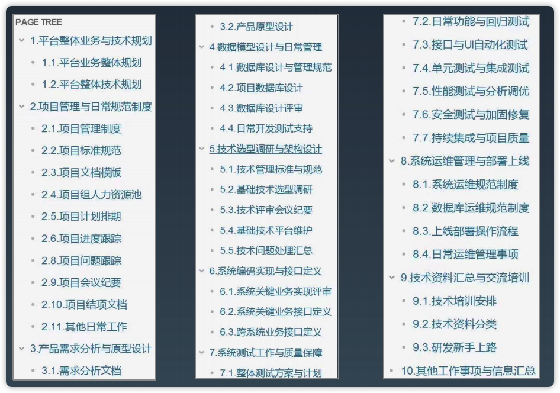

# 第28课 分布式系统架构-如何设计一个秒杀系统

## 1.从架构师视角出发

### 像架构师一样思考问题

**为什么要做秒杀？**

通过少量的超低价格的商品或稀缺的商品进行秒杀，吸引更多流量（客流量）、关注度、热度等，以带来其他更多收益。

**为什么秒杀难做？**

具备不确定性和复杂度。

> 目前国内最大的并发数是阿里双十一刚开始的几秒，大概是54万TPS。

### 秒杀的本质

* 业务上：一场营销促销活动，具有明确的活动业务特点。
* 技术上：一种主动DDos攻击，具备技术的不确定性和复杂度。

### 早期的秒杀怎么做

早期的单体系统，不具备很好的扩展性，一有突发流量就挂。大促宕机是常态。

> 淘宝大概是12年到13年解决了秒杀活动问题。

### 技术上有哪些优化办法

* 1.丢弃订单：最早期，量太大扛不住，直接在前端随机reject一些请求，直接返回抢单失败，简单粗暴，但是有效。比如10万个人抢100个iphone，只要提前预测大概有1万以上的人参与（通过资格确认、报名等方式收集新），那么可以直接随机挡回去99%的流量都没有问题。

* 2.优化吞吐：在秒杀开始之前，提前准备一大批机器用来部署应用，通过进行应用拆分、服务化、分库分表等优化后端性能；前端业务可以增加一定量的机器，做好容量规划，弹性扩容，以此提升吞吐量。

* 3.异步队列：使用可堆积的消息队列或内存消息队列，将抢单处理放到消息队列中异步处理。如果抢单具有强顺序性，那么都先进队列，然后拿前N个出来平滑处理，剩下的都可以进行失败处理；或者可以使用一个定长的队列，超过长度直接写入失败。队列 把并发变成串行，从而去掉了锁。

* 4.内存分配：一些具体的业务，也会考虑预热。提前在每个应用的机器节点的内存中分配库存数量，然后应用可以直接在内存中操作库存，避免多应用同时操作库存的锁竞争。

* 5.拆分扩展：针对不同类型、不同商家、不同来源的商品，部署到不同的促销集群，这样就把压力分散。具体到每个商家秒杀的压力就很小了。

* 6.服务降级：越重要的抢单，买家越关心抢单是否成功，而不是很在意订单的后续处理。可以将订单抢单成功后，后续的物流处理等在秒杀过后，或服务器压力小时再处理，后通过异步队列处理，买家不会在意是1分钟还是1小时订单处理完成。

**注意：** 其中的部分优化方式可能会导致销售不足或者超卖，销售不足可以在抢购里加一些名单补发，或者加一轮秒杀。超卖会比较麻烦，所以一般会多备一些货，一般秒杀都会允许超卖。

### 系统设计上的改进和优化

对于交易业务来说，一般的交易业务模式是固定的，促销活动是常态变化的，所以有了将营销促销活动，从交易业务系统里剥离出来，成为独立的系统。

促销活动的业务要求：

* 促销活动的不同，一般有满减，满赠，折扣等。
* 业务的因素，限定用户范围、商品范围，规定发放的形式、使用的时限等，还和财务、预算与核销等相关。
* 其他：优惠券、红包、积分等。

## 2.具体要做哪些事情

### 做系统架构设计的步骤

1. 分析现状

目的：

* 明确具体的需求，特别是要挖掘非功能性需求。
* 分析可行性，明确可行性与相关技术指标。

产出：新需求文档，系统当前现状（包括业务和技术指标）的相关文档和设计图，可行性分析文档。

2. 寻找路径

目的：

* 实现整体方案设计。
* 完成POC验证和关键技术选型。

产出：设计方案初稿，关键问题分析，关键技术选型报告，POC验证的场景设计文档和DEMO，测试/压测结果等。

3. 确定方案

目的：

* 根据分析设计出最终方案，并与各方达成一致。
* 完善方案相关设计图和文档，成为项目研发的蓝图。

产出：架构设计方案和设计图终稿，组织会议同步和宣贯。

## 3.功能性和非功能性

### 功能性需求

### 非功能性需求

根据业务指标，估算并发指标，以此来反推非功能性需求。

但是实际情况往往是压力到底多大不知道，可以使用下面的方式：

* 根据线上压测，现有系统指标的测量和计算。
* 参考业内水平，设定并发流量的倍数。
* 建立基线。

### 注意事项

脱离场景谈性能，都是耍流氓。

需要注意：不同互联网电商的发展阶段不同，对于秒杀系统的实际需求和解决办法，是有非常大的差异的。在请求量不大的时候，通过扩展数据库就能解决秒杀问题，当请求量大一些的时候，可以通过MQ异步处理，或者将服务进行拆分，使用缓存等手段解决问题，数据量再大时候，可能要通过内存网格解决问题。

**面试与实战的区别？**

面试的时候说到上面技术优化的6点就差不多了，但是实际设计一个秒杀系统区别还是很大的。

## 4.如何编写设计文档

### 系统设计文档

传统的软件开发一般有概要设计和详细设计。

概要设计：分析需求，提出需求的解决方案，对其中重要的需求点进行分析设计。
详细设计：指导开发，将系统怎么做讲述清楚。

互联网相关系统不会这么复杂，关键在于描述清楚我们的系统。

### 扩展到整个研发项目应该使用的文档结构

## 5.如何考虑技术选型

### 技术选型的原则和方法

原则上，综合考虑采用相当成熟的技术；选择的技术需要符合公司的技术发展路线和选型规则（如果有）。

方法：基于关键场景编写case，实现demo，验证多种类似技术的各项指标。

### 是否要采用最新的技术

参考公司和团队的研发成熟度和技术能力水平，业界技术雷达，可以适度预研，不建议 大规模采用不熟悉的新技术。

> 当你采用一个不熟悉的东西试图去解决已有问题，那么恭喜你，你现在有了2个问题。
> 关于技术储备：如果团队中有100个人，会抽出10个人不做业务开发，他们用来解决技术难题、做技术培训、提高大家的研发效能等，以此提高整个团队的生产力。如果团队小，可以分工合作，每个人负载一个点，最后合成一个大的点，这样可以促进团队的整个技术储备。

## 6.其他相关设计要点

### 系统设计上的其他要考虑的要点

* 体系化的稳定性建设：可以使用混沌工程，检验系统稳定性。
* 架构团队与架构能力建设：对于
* 营销活动工具的平台化建设：营销活动总是在变化的，通过营销活动平台化的建设，可以快速响应营销活动的变化。

## Tips

* 并不是所有的技术问题都要从技术的角度去解决，有些问题需要花费很大的成本从技术角度解决；可以从业务角度以较低的成本解决这个问题。
* 积分联盟：一般对于积分的兑换等，都是挂到财务账上的，早期积分没有有效期，如果用户一直不来兑换积分，这个账目就不能消掉。所以有了积分联盟，让用户的积分可以在其他平台进行自由兑换。
* 秒杀不仅本身的秒杀系统会有压力，还会带来其他相关系统的压力。
* 对于需求的变更，要有需求周期的概念。在一个需求周期内进行需求变更，提出需求变更要有流程（比如提变更单让领导审批等）。
* 考验架构能力的一般都是非功能性需求。做架构设计一部分是为了快速开发。
* 做设计需要从业务、人、技术来综合考虑。
* 引入新技术，长期来看是必须的，但是短期上看不一定是必须的。
