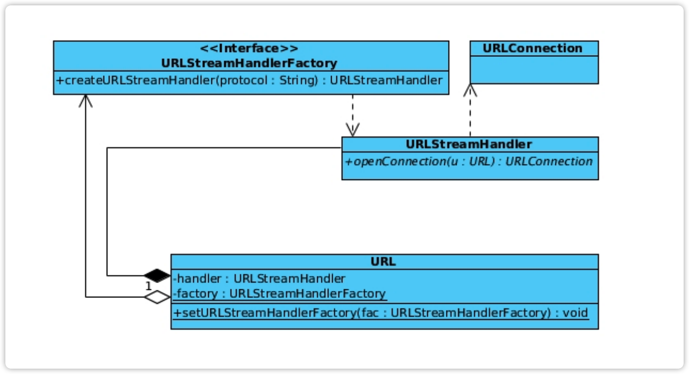

# Spring资源管理

## Spring资源管理的引入动机

Java已经提供标准的资源管理，Spring为什么还重复造轮子？

* Java标准的资源管理虽然强大，但是扩展复杂，资源的存储方式并不统一，Spring的作者根据自己的理解以及需要需要重新实现资源管理。
* Spring要自立门户：Spring的目标是做成一个生态，所以有些实现不能特别依赖于第三方。
* Spring的“抄”、“超”和“潮”：Spring的资源管理借鉴了Java的资源管理，但是实现上超越了Java的资源管理，引领技术潮流。

## Java标准资源管理

**Java标准的资源定位：**

|资源|说明|
|--|--|
|面向资源| 文件系统、artifact（jar、war、ear 文件）以及远程资源（HTTP、FTP 等）|
|API整合| java.lang.ClassLoader#getResource、java.io.File 或 java.net.URL|
|资源定位| java.net.URL 或 java.net.URI|
|面向流式存储| java.net.URLConnection: 根据上面的URL或URI获取特定资源的连接。|
|协议扩展| java.net.URLStreamHandler 或 java.net.URLStreamHandlerFactory|

> URLStreamHandlerFactory用来根据不同的协议创建URLStreamHandler，URLStreamHandler根据URL来创建URLConnection。

**基于java.net.URLStreamHandlerFactory扩展协议**

从上图可以知道，URLStreamHandlerFactory用来根据不同的protocol创建URLStreamHandler，URLStreamHandler根据URL来创建URLConnection。而URL拥有URLStreamHandler和URLStreamHandlerFactory变量，而且URLStreamHandlerFactory是静态的，setURLStreamHandlerFactory方法也是静态的，并且setURLStreamHandlerFactory方法有检查，如果factory不为空，会抛出错误，也就是说在一个JVM中一般URL.class只会存在一个，对应的factory也只能有一个被使用，其他的factry都不会使用。

JDK1.8内置的协议实现：

|协议| 实现类|
|--|--|
|file| sun.net.www.protocol.file.Handler|
|ftp| sun.net.www.protocol.ftp.Handler|
|http| sun.net.www.protocol.http.Handler|
|https| sun.net.www.protocol.https.Handler|
|jar| sun.net.www.protocol.jar.Handler|
|mailto| sun.net.www.protocol.mailto.Handler|
|netdoc| sun.net.www.protocol.netdoc.Handler|

可以看出的规律是jdk提供的默认条件的Handler的包名需要满足：sun.net.www.protocol.${protocol}.Handler。

如果要实现对URLStreamHandler的扩展协议需要满足：

通过 Java Properties的`java.protocol.handler.pkgs`指定实现类包名，实现类名必须为“Handler”。如果存在多包名指定，通过分隔符 “|”。需要注意的是一般都在Java启动命令中通过—D传递这个参数，如果启动后或启动中在代码中设置，可能参数`java.protocol.handler.pkgs`以及读取完成了，不会起作用。

扩展协议的具体原理参考`java.net.URL#getURLStreamHandler`。
