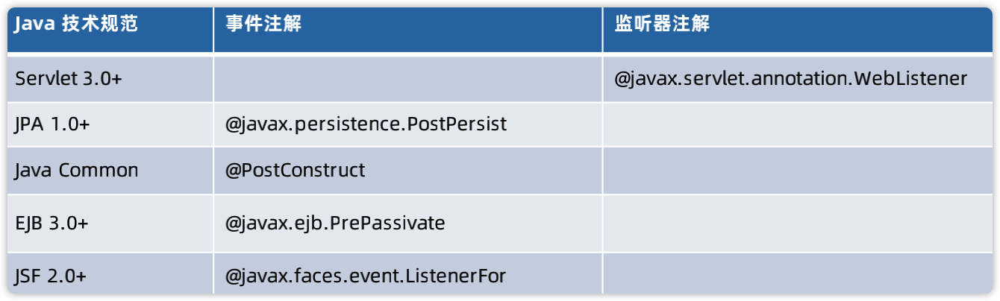

# Spring事件

## Java事件/监听器编程模型

设计模式：观察者模式的扩展

* 被观察者（消息的发送者）：java.util.Observable
* 观察者：java.util.Observer

标准化接口：

* 事件对象：java.util.EventObject，一般发送的消息都要继承这个类，不过没有强制要求。
* 事件监听器：java.util.EventListener，所有的事件监听器都需要实现该接口，这是一个空接口，没有强制要求实现。

Java事件监听示例：[ObserverDemo.java](https://github.com/wkk1994/spring-ioc-learn/blob/master/event/src/main/java/com/wkk/learn/spring/ioc/event/ObserverDemo.java)

## 面向接口的事件/监听器设计模式

事件/监听器场景举例：

|Java技术规范|事件接口|监听器接口|说明|
|--|--|--|--|
|JavaBeans|java.beans.PropertyChangeEvent|java.beans.PropertyChangeEventListener||
|Java AWT|java.awt.event.MouseEvent|java.awt.event.MouseListener|监听鼠标的事件|
|Java Swing|javax.swing.event.MenuEvent|javax.swing.event.MenuListener|swing的菜单相关的事件|
|Java Preference|java.util.prefs.PreferenceChangeEvent|java.util.prefs.PreferenceChangeListener|用于接收用户编好的事件|

> 单事件和多事件：单事件是指一个监听器只有一个事件，多事件是指一个监听器可以监听多个事件。

## 面向注解的事件/监听器设计模式



> 生命周期和事件没有本质的区别，都是在特定的阶段进行回调或触发。

## Spring标准事件-ApplicationEvent

ApplicationEvent是Java标准事件EventObject的扩展，它扩展添加了发生事件的时间戳。

ApplicationContextEvent是ApplicationEvent的扩展，ApplicationContextEvent和Spring应用上下文（ApplicationContext）密切相关，它将Spring应用上下文作为事件源进行保存。它的具体实现有：

* org.springframework.context.event.ContextClosedEvent
* org.springframework.context.event.ContextRefreshedEvent
* org.springframework.context.event.ContextStartedEvent
* org.springframework.context.event.ContextStoppedEvent

## 基于接口的Spring事件监听器

Spring的事件监听器也遵循规则，实现了Java的标准事件监听器java.util.EventListener。

* 核心API：org.springframework.context.ApplicationListener
* 处理方法：onApplicationEvent(ApplicationEvent)
* 事件类型：org.springframework.context.ApplicationEvent

可以看出ApplicationListener只有一个事件监听的方法`onApplicationEvent`，所以说ApplicationListener不同于Java的一些事件监听器，它只关注某一个事件，或者说它一次只处理一个事件。可以说ApplicationListener是单一的设计原则。

基于接口的Spring事件监听示例：[ApplicationListenerDemo.java](https://github.com/wkk1994/spring-ioc-learn/blob/master/event/src/main/java/com/wkk/learn/spring/ioc/event/ApplicationListenerDemo.java)

## 基于注解的Spring事件监听器

Spring支持使用注解的方式注册事件监听器，API：org.springframework.context.event.EventListener，它的特性有：

* 支持多ApplicationEvent类型，没有接口的约束。
* 支持在方法上注释。
* 支持异步执行，只需要在方法上添加@Async，并且激活异步执行（@EnableAsync）
* 支持泛型类型事件。
* 配合@Order注解，可以实现顺序控制。

基于注解实现Spring事件监听器：[AnnotationApplicationListenerDemo.java](https://github.com/wkk1994/spring-ioc-learn/blob/master/event/src/main/java/com/wkk/learn/spring/ioc/event/AnnotationApplicationListenerDemo.java)

## 注册Spring ApplicationListener

* 方法一：ApplicationListener作为Spring Bean注册

* 方法二：使用ConfigurableApplicationContext API注册

  ```java
  // 注册事件监听
  applicationContext.addApplicationListener(event -> {
      System.out.println("接收到Spring事件：" + event);
  });
  ```

## Spring事件发布器

通过Spring发布事件的方式：

* 方法一：通过ApplicationEventPublisher发布Spring事件
  * 获取ApplicationEventPublisher的方式只能通过依赖注入，使用ApplicationEventPublisherAware回调注入。

* 方法二：通过ApplicationEventMulticaster发布Spring事件
  * 获取ApplicationEventMulticaster的方式可以通过依赖注入和依赖查找。

ApplicationEventPublisher发布Spring事件示例：[ApplicationEventPublisherDemo.java](https://github.com/wkk1994/spring-ioc-learn/blob/master/event/src/main/java/com/wkk/learn/spring/ioc/event/ApplicationEventPublisherDemo.java)

## Spring层次性上下文事件传播

当Spring应用出现多层次Spring应用上下文（ApplicationContext）时，如SpringMVC、SpringBoot或SpringCloud场景下，由子ApplicationContext发起Spring事件可能会传递到其Parent ApplicationContext（直到Root）的过程。

如何避免事件的传播：

* 定位Spring事件源（ApplicationContext）进行过滤处理。
* 在事件监听器中添加逻辑判断，如果当前事件已经处理过，就不处理了。

Spring的事件在上下文中传播的代码可以参考`org.springframework.context.support.AbstractApplicationContext#publishEvent(java.lang.Object, org.springframework.core.ResolvableType)`中的：

```text
if (this.parent != null) {
    if (this.parent instanceof AbstractApplicationContext) {
        ((AbstractApplicationContext) this.parent).publishEvent(event, eventType);
    }
    else {
        this.parent.publishEvent(event);
    }
}
```

层次性Spring事件传播示例：[HierarchicalSpringEventPropagateDemo.java](https://github.com/wkk1994/spring-ioc-learn/blob/master/event/src/main/java/com/wkk/learn/spring/ioc/event/HierarchicalSpringEventPropagateDemo.java)

## Spring内建事件

ApplicationContextEvent派生事件：

* ContextRefreshedEvent：Spring应用上下文就绪事件
* ContextStartedEvent：Spring上下文启动事件
* ContextStopedEvent：Spring上下文停止事件
* ContextClosedEvent：Spring上下文关闭事件

在调用Spring上下文refresh、start、stop、close方法时会触发对应的事件，ApplicationContext接口继承了ApplicationEventPublisher，所以Spring上下文的实现类都实现了事件发生的接口publishEvent，具有事件发送能力。

> start 和 stop 方法是一种辅助的特性，通常使用不多。

## Spring 4.2 Payload事件

Spring Payload事件API：org.springframework.context.PayloadApplicationEvent，它的使用场景是：简化Spring事件的发送，关注源事件本身，在调用publishEvent(Object)方法发布事件时，它会将Object作为source，构建出一个PayloadApplicationEvent实例，作为事件来传递。

发送方法：ApplicationEventPublisher#publishEvent(java.lang.Object)

PayloadApplicationEvent为什么不是一个良好的扩展？

* PayloadApplicationEvent本身是用来作为Spring框架内部使用，但是内部使用的很少，而且是public，允许继承。
* 在继承PayloadApplicationEvent的时候不能简单继承，要指定实现类的具体化否则报错`MyPayloadApplicationEvent<String> extends PayloadApplicationEvent<String>`。
* 在发送事件时，如果是普通的事件使用publishEvent(java.lang.Object)方法就好，它会转换成PayloadApplicationEvent，没必要在创建一个PayloadApplicationEvent实例进行发送。
* 在事件监听时，只能监听PayloadApplicationEvent，不能具体到监听泛型具体化的消息内容，比如PayloadApplicationEvent\<String>，这是一个局限性。

扩展PayloadApplicationEvent实现示例：[PayloadApplicationEventDemo.java](https://github.com/wkk1994/spring-ioc-learn/blob/master/event/src/main/java/com/wkk/learn/spring/ioc/event/PayloadApplicationEventDemo.java)

## 自定义Spring事件

* 1.扩展org.springframework.context.ApplicationEvent；
* 2.实现org.springframework.context.ApplicationListener；
* 3.注册实现的ApplicationListener；
* 4.发布扩展的ApplicationEvent事件。

自定义Spring事件示例：

[MySpringEvent.java](https://github.com/wkk1994/spring-ioc-learn/blob/master/event/src/main/java/com/wkk/learn/spring/ioc/event/MySpringEvent.java)
[MySpringEventListener.java](https://github.com/wkk1994/spring-ioc-learn/blob/master/event/src/main/java/com/wkk/learn/spring/ioc/event/MySpringEventListener.java)
[MySpringEventDemo.java](https://github.com/wkk1994/spring-ioc-learn/blob/master/event/src/main/java/com/wkk/learn/spring/ioc/event/MySpringEventDemo.java)